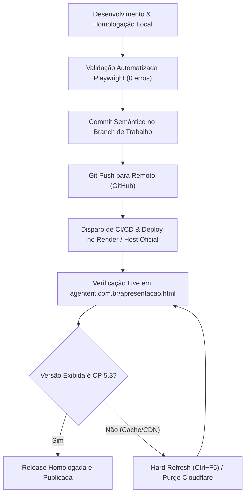

# DIRETRIZ PERMANENTE DE PRODUTO — RELEASE NOTES VIVO
## SISTEMA AGENTE RIT (ROTAS INTELIGENTES DE TRANSPORTES)

> **Documento:** DP-RIT-001  
> **Status:** **ATIVO & OBRIGATÓRIO**  
> **Data de Homologação:** 29 de Setembro de 2026  
> **Versão Vigente:** Checkpoint 5.3  
> **Aplicabilidade:** Todas as entregas, sprints e checkpoints operacionais do Agente RIT

---

### 1. OBJETIVO E PRINCÍPIO ARQUITETURAL

A tela **"COMO FUNCIONA"** (`public/apresentacao.html`), acessada a partir da página inicial do Agente RIT (`public/index.html`), é designada como o **Portal Oficial de Release Notes Vivo e Onboarding Operacional Contínuo**.

Ela deixa de ser uma apresentação institucional estática para funcionar como o **registro dinâmico da evolução real do produto**, servindo simultaneamente a 5 propósitos:
1. **Onboarding Automático:** Apresentação imediata para novos usuários e operadores do CCO.
2. **Treinamento Contínuo:** Catálogo visual e funcional de tudo que a ferramenta executa.
3. **Release Notes Vivo:** Atualização transparente e versionada do que entrou em produção/homologação.
4. **Transparência de Governança:** Declaração explícita de privacidade, escopo e inteligência de dados.
5. **Rastreabilidade Probatória:** Exibição das métricas de auditoria (testes, evidências e conformidade).

---

### 2. A REGRA PERMANENTE DE ATUALIZAÇÃO

> [!IMPORTANT]
> **REGRA DE OURO (GATE DE HOMOLOGAÇÃO):**  
> Toda e qualquer nova funcionalidade ou melhoria aprovada em processo de homologação técnica deve, **obrigatoriamente antes do encerramento do checkpoint ou abertura de Pull Request**:
> 1. Atualizar o arquivo de dados canônico `public/data/releases.json`.
> 2. Atualizar a apresentação `"Como Funciona"` (`public/apresentacao.html`), sincronizando o cabeçalho versionado e o Slide 10 de Últimas Entregas.

#### Metadados Mínimos Obrigatórios por Funcionalidade (`public/data/releases.json`):
Cada entrega homologada deve refletir no JSON:
1. **Identificador & Data:** Data canônica da conclusão (ex: `29/09/2026`).
2. **Nome Canônico:** Denominação clara e padronizada (ex: `Caravanas Inteligentes`, `Drawer Tático`).
3. **Subtítulo & Tag Operacional:** Ex: `Módulo 02 · Homologado`, `Interface CCO`, `Governança`.
4. **Descrição Sucinta:** Impacto prático e escopo executado.
5. **Status da Homologação:** Ex: `completed` / `Homologado`.
6. **Métricas de Confiabilidade:** Testes automatizados, smoke tests, evidências e auditorias.

---

### 3. IDENTIFICAÇÃO VISUAL IMEDIATA DE VERSÃO (CABEÇALHO PADRONIZADO)

Para garantir que o usuário e a auditoria saibam imediatamente se estão visualizando a versão homologada ou uma versão em cache local/CDN, a barra superior de `public/apresentacao.html` deve conter:
- **Título da Página:** `<title>Agente RIT — Como Funciona | Versão CP X.Y (DD/MM/AAAA) · Release Notes Vivo</title>`
- **Badges Visuais no Topo:**
  - `COMO FUNCIONA`
  - `VERSÃO CP X.Y · ATUALIZADO EM DD/MM/AAAA` (Badge destacado em cor de contraste)
  - `RELEASE NOTES VIVO` (Badge pulsante/destacado)
  - `CHECKPOINT X.Y` (Pill operacional)
  - `🟢 EVIDENCIADO` / `OPERACIONAL` (Status dinâmico via health check)

---

### 4. ESTRUTURA DOS SLIDES PADRONIZADOS (DECK DE 10 SLIDES)

| Slide | Título / Módulo | Finalidade Operacional | Artefato Visual Associado |
| :-: | :--- | :--- | :--- |
| **01** | **Capa Operacional do Checkpoint** | Status 🟢 Homologado, 4 KPIs Operacionais (95/95, 20/20, 12, 15/15) e 5 Pilares | Cards Operacionais + Pilares |
| **02** | **Módulo RIT Alerta** | Monitoramento de Ocorrências (CET-Rio, COR, Rodovias) | `assets/apresentacao/rit_alerta_desktop.png` |
| **03** | **Caravanas Inteligentes** | Gestão de Caravanas, Multi-Rotas e Drawer Tático (CP 5.3) | `assets/apresentacao/rit_caravanas_multiplas_rotas.png` |
| **04** | **Governança & Privacidade** | Escopo Controlado (`isSynthetic: true`, `isGpsBased: false`) | `assets/apresentacao/rit_validacao_governanca_drawer.png` |
| **05** | **Inteligência Cartográfica** | Esri World Imagery + OpenStreetMap com Failover Silencioso | `assets/apresentacao/rit_caravanas_fallback_mapa.png` |
| **06** | **Auditoria & Confiabilidade** | Métricas CI/CD (95 testes, 20 smoke tests, hashes SHA-256, JUnit XML) | Grade de Evidências Primárias |
| **07** | **Região de Cobertura** | As 5 Regionais Globo (RJ, SP, BSB, REC, BH) | Mosaico das Capitais |
| **08** | **Roadmap de Evoluções** | 6 Itens em Estudo (Analytics, Painel C-Level, IA de Rotas) | Grid de 6 Próximos Passos |
| **09** | **Estado Atual do Sistema** | Prontidão Operacional, Acessos Rápidos (Dashboard, Cockpit) e Diretriz | Indicadores de Prontidão e Links |
| **10** | **Últimas Entregas (Release Notes Vivo)** | Histórico Dinâmico alimentado por `data/releases.json` com botão de sincronização | Cards de Features + Timeline Histórica |

---

### 5. CADEIA DE PUBLICAÇÃO EM PRODUÇÃO (DEPLOY & VERIFICAÇÃO)

> [!WARNING]
> A aprovação local de testes e screenshots é condição necessária, mas **não suficiente** para encerramento de release em produção. A cadeia completa deve ser cumprida:

#### Protocolo de Verificação Live pós-Deploy:
1. Executar inspeção de headers com `curl.exe -sI https://agenterit.com.br/apresentacao.html`.
2. Verificar cabeçalhos `last-modified`, `etag` e `cf-cache-status`.
3. Inspecionar o título e top-subtitle da página em produção para confirmar o selo `VERSÃO CP 5.3 · ATUALIZADO EM 29/09/2026`.
4. Validar o carregamento do endpoint `/data/releases.json` na URL pública.

---

### 6. CHECKLIST DE CONFORMIDADE PARA NOVAS RELEASES

Antes de considerar uma entrega concluída:
- [x] O arquivo canônico `public/data/releases.json` foi atualizado com a versão, data e features homologadas.
- [x] O slide correspondente ao módulo foi criado ou atualizado em `public/apresentacao.html`.
- [x] Os badges de versão e data na barra superior foram incrementados (`VERSÃO CP 5.3 · ATUALIZADO EM 29/09/2026`).
- [x] Os 4 cards operacionais da capa (Slide 1) refletem os números reais da suíte de testes.
- [x] O Slide 10 exibe a lista dinâmica alimentada por JSON com fallback embutido.
- [x] As capturas de tela associadas são reais (Playwright em Chromium headless) e estão em `public/assets/apresentacao/` e `docs/screenshots/`.
- [x] Os scripts de navegação (teclado, dots, contadores `1 / 10` e sincronização) foram validados com 0 erros de console.
- [x] A suíte de testes `npm.cmd test` mantém 95/95 testes aprovados.
- [x] O comando de auto-auditoria `npm.cmd run audit:evidence` mantém 15/15 verificações aprovadas.
