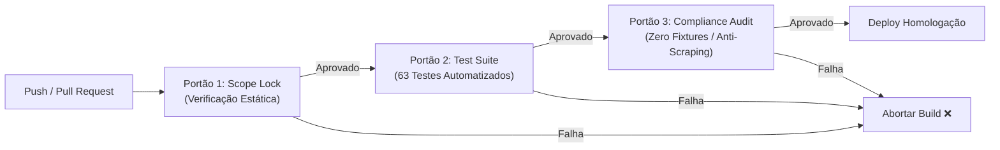

# Plano Técnico e Operacional: CHECKPOINT 5 (v2.1)
## Prontidão para Implantação Corporativa Controlada — RIT ALERTA

---

### Sumário Executivo e Diretriz de Publicação

Com a homologação técnica do **CHECKPOINT 4.1** em ambiente local, o módulo **RIT ALERTA** encerra sua fase de construção de código e validação de testes. 

Em estrito alinhamento às diretrizes corporativas registradas no projeto, a governança de publicação fica formalmente estabelecida sob os seguintes termos:

> [!IMPORTANT]
> **Termo de Autorização de Publicação Controlada**:
> As funcionalidades contempladas no **CHECKPOINT 5** estão **autorizadas para publicação controlada em ambiente de homologação ou validação técnica**, com o objetivo de avaliação funcional, acompanhamento operacional, validação visual da interface e execução dos testes de aceitação pelos usuários responsáveis.
> 
> A disponibilização em **ambiente de produção corporativa definitiva** permanece condicionada à conclusão dos requisitos de governança, segurança, infraestrutura e conformidade previstos neste plano.

```
┌────────────────────────────────────────────────────────────────────────┐
│                        ESTRUTURA DO CHECKPOINT 5                       │
├─────────────────────┬──────────────────────────┬───────────────────────┤
│ 1. INFRAESTRUTURA   │ 2. BANCO DE DADOS        │ 3. PIPELINE & TRAVAS  │
│ - TLS / HSTS / CSP  │ - Privilégio Mínimo      │ - Validação Estática  │
│ - SSO / OAuth2      │ - Backup pré-deploy      │ - 63 Testes no CI     │
│ - Segregação .env   │ - DDL UP/DOWN Idempotente│ - Smoke Test HTTP     │
├─────────────────────┼──────────────────────────┼───────────────────────┤
│ 4. OBSERVABILIDADE  │ 5. PROTOCOLO DE ROLLBACK │ 6. GOVERNANÇA & LGPD  │
│ - Telemetria JSON   │ - Reversão em 60s        │ - Assessment Seg/Priv │
│ - Degradação Alertas│ - Rollback Transacional  │ - Inventário de Dados │
│ - Expurgo (30 dias) │ - Critérios de Aborto    │ - Matriz RBAC / Aceite│
└─────────────────────┴──────────────────────────┴───────────────────────┘
```

---

### Quadro Executivo de Status Atual do Projeto

| Item | Status | Detalhamento / Observação |
| :--- | :--- | :--- |
| **Desenvolvimento funcional** | ✅ **Concluído** | Módulo RIT ALERTA implementado com Split 40/60, feed, mapa tático e Drawer |
| **Testes automatizados** | ✅ **Concluído** | 63 testes aprovados (0 falhas) cobrindo DTOs, deduplicação, escopo e travas |
| **Publicação para homologação** | 🚀 **Autorizada** | Liberada para validação funcional, visual e operacional em ambiente controlado |
| **Avaliação visual da interface** | ⏳ **Pendente** | Submissão dos mockups executivos para validação formal do patrocinador |
| **Homologação operacional** | ⏳ **Pendente** | Acompanhamento assistido com operadores CCO em ambiente de homologação |
| **Infraestrutura corporativa definitiva** | ⏳ **Pendente** | Definição formal sob tutela de TI, Arquitetura e Segurança da Informação |
| **Produção corporativa** | 🔒 **Condicionada ao Checkpoint 5** | Bloqueada até cumprimento integral da Definition of Done (DoD) |

---

### Entregável Adicional: Mockup Executivo da Interface Final

Para subsidiar a avaliação visual do patrocinador e dos operadores antes do deploy em homologação, o RIT ALERTA disponibiliza as prévias visuais em alta fidelidade com destaque para os 7 componentes operacionais:

````carousel

<!-- slide -->

<!-- slide -->

<!-- slide -->

<!-- slide -->

````

> [!NOTE]
> As figuras 1 e 2 constituem **IMAGEM ILUSTRATIVA DE APRESENTAÇÃO EXECUTIVA — MOCKUP CONCEITUAL DO CHECKPOINT 5**. As figuras 3, 4 e 5 constituem **CAPTURAS REAIS DO SISTEMA EM RUNTIME (PLAYWRIGHT)** com hashes SHA-256 auditados.

#### Destaques Operacionais da Interface Final

1. **Layout Final (Split 40/60)**: Painel operacional dividido mantendo o mapa tático sempre visível à direita (60%) enquanto a lista de ocorrências é navegada à esquerda (40%).
2. **Painéis de Monitoramento e KPIs de Topo**: 5 cards executivos (Ocorrências Ativas, Corredores Bloqueados, Lentidão Crítica, Provedores Públicos e Última Sincronização).
3. **Filtros Estruturados**: Dropdown de Corredores (Linha Vermelha, Av. Brasil, Linha Amarela), Dropdown de Severidade (Crítico, Alto, Moderado, Baixo) e busca textual por logradouro/bairro.
4. **Alertas e Bloco de Divergência**: Destaque visual âmbar/amarelo quando fontes públicas reportam informações conflitantes (ex.: CET-Rio reportando lentidão moderada vs TomTom Orbis reportando retenção severa).
5. **Indicadores de Saúde dos Provedores**: Telemetria contínua exibindo taxa de disponibilidade (100% Online) das APIs públicas oficiais.
6. **Drawer de Análise com 4 Câmeras nos 4 Estados**: Painel lateral sobreposto com câmeras categorizadas sob nomenclatura rigorosa (**Disponível**, **Desatualizada**, **Offline**, **Consulta na Fonte**) e recomendações consultivas em tom de governança (*"Alternativa para avaliação: [Corredor]"*).
7. **Fluxos de Navegação e Responsividade**: Adaptação dinâmica para **Desktop (1920×1080)** e **Notebook (1366×768)** preservando a densidade de informação sem rolagem horizontal.

---

### Pilar 1: Infraestrutura, Rede e Autenticação Corporativa

#### 1.1 Definição do Ambiente de Hospedagem Corporativa
> [!IMPORTANT]
> **Diretriz de Governança**: O ambiente de produção corporativa será definido pelas áreas responsáveis de **Infraestrutura Cloud**, **Arquitetura** e **Segurança da Informação** após a conclusão do processo formal de homologação e contratação, não constituindo decisão técnica isolada do projeto.

#### 1.2 Configuração de Ambiente e Segregação de Segredos
- **Matriz de Variáveis de Ambiente Mandatórias**:
  - `NODE_ENV=production`
  - `PERSISTENCE_MODE=POSTGRES`
  - `RIT_ALERT_DEMO_MODE=false` (terminantemente desativado em produção)
  - `RIT_ALERT_ALLOW_FIXTURES=false` (bloqueio rígido no bootstrap)
  - `RIT_ALERT_STORE_RAW_PAYLOAD=false` (armazena somente hash criptográfico SHA-256)
  - `COR_RIO_MIN_INTERVAL_MS=60000` (respeito a rate limit e mutex contra concorrência)
- **Cofre de Segredos**: Credenciais de banco e chaves de provedores devem ser injetadas exclusivamente via variáveis de ambiente da plataforma homologada ou cofre corporativo (ex.: Azure Key Vault / AWS Secrets Manager), sem qualquer arquivo `.env` versionado no Git.

#### 1.3 Headers de Segurança HTTP e Isolamento de Origem
- **Headers Mandatórios**:
  - `Strict-Transport-Security: max-age=31536000; includeSubDomains; preload`
  - `Content-Security-Policy`:
    ```
    default-src 'self';
    connect-src 'self' https://appcor.cor-rio.work https://aplicativo.cocr.com.br;
    img-src 'self' data: https://*.tile.openstreetmap.org https://cameras.cetsp.com.br;
    style-src 'self' 'unsafe-inline';
    script-src 'self';
    frame-ancestors 'none';
    ```
  - `X-Content-Type-Options: nosniff`
  - `X-Frame-Options: DENY`
  - `Referrer-Policy: strict-origin-when-cross-origin`

#### 1.4 Autenticação e Controle de Acesso Corporativo (RBAC)
- **Restrição de Acesso**: Acesso limitado exclusivamente aos colaboradores autorizados da Globo (operadores CCO e analistas de transporte).
- **Mecanismo de Sessão**: Integração com o provedor corporativo de identidade (SSO/OAuth2) ou token JWT com tempo de expiração curto (15 minutos) e renovação contínua.
- **Proteção do Módulo**: A rota `/api/traffic-alert/*` herda a validação de sessão corporativa existente no `server/auth.js`.

---

### Pilar 2: Governança do Banco de Dados PostgreSQL de Produção

#### 2.1 Princípio do Privilégio Mínimo (Least Privilege)
Em conformidade com a segregação de dados sensíveis e restrição a dados operacionais:
- O módulo RIT ALERTA **não deve** utilizar o superusuário (`postgres`) para conexões de aplicação.
- Criação de uma *role* dedicada restrita:
  ```sql
  -- Executado pelo DBA na janela de implantação
  CREATE ROLE rit_traffic_app WITH LOGIN PASSWORD '***';
  
  -- Permissões estritamente limitadas às 5 tabelas públicas do RIT ALERTA
  GRANT SELECT, INSERT, UPDATE, DELETE ON 
      traffic_incidents, 
      traffic_incident_sources, 
      traffic_incident_history, 
      traffic_provider_health, 
      traffic_camera_matches 
  TO rit_traffic_app;

  -- NENHUM ACESSO concedido às tabelas operacionais, cadastrais ou de frotas
  REVOKE ALL ON ALL TABLES IN SCHEMA public FROM rit_traffic_app;
  GRANT USAGE ON SCHEMA public TO rit_traffic_app;
  ```

#### 2.2 Cronograma em 4 Fases para a Janela de Implantação
A atuação conjunta com a equipe de DBA e infraestrutura seguirá rigorosamente o faseamento abaixo:

- **Fase 1: Alinhamento Prévio e Segurança**
  - Reunião técnica com o DBA responsável.
  - Definição e homologação da *role* dedicada (`rit_traffic_app`).
  - Aprovação formal da matriz de concessão de privilégios mínimos.
- **Fase 2: Salvaguarda e Validação Transacional**
  - Execução de backup prévio completo (`pg_dump -Fc -v`).
  - Teste de restauração em base de homologação para garantia de integridade.
  - Execução controlada da migration UP (`001_traffic_alert_schema.sql`).
  - Confirmação de idempotência e prontidão do script de rollback (`001_traffic_alert_schema.down.sql`).
- **Fase 3: Homologação Integrada e Smoke Test**
  - Submissão da aplicação ao roteiro de Smoke Test automatizado de 5 minutos.
  - Validação de conectividade e leitura com a *role* restrita.
- **Fase 4: Decisão Formal de Go/No-Go**
  - Aprovação final de entrada em produção condicionada ao término da homologação corporativa de infraestrutura.

---

### Pilar 3: Pipeline CI/CD e Travas Estáticas de Governança

#### 3.1 Esteira Automatizada de Validação (CI/CD)
O pipeline de build e deploy deve conter 3 portões de qualidade obrigatórios:



- **Portão 1 (Scope Lock)**: Análise estática que bloqueia o build caso qualquer arquivo em `server/traffic-alert/` ou `public/js/traffic-alert/` contenha referências a tabelas proibidas (`motoristas`, `passageiros`, `veiculos`) ou APIs de hardware (`geolocation`, `getCurrentPosition`).
- **Portão 2 (Suite de 63 Testes)**: Execução de `node --test test/traffic-alert/*.test.js` com exigência de 100% de aprovação (0 falhas permitidas).
- **Portão 3 (Validação de Não-Scraping e Fixtures)**: Testes 38 e 39 garantem que nenhuma alteração externa introduziu parsing HTML.

---

### Pilar 4: Observabilidade, Telemetria e Retenção de Dados

#### 4.1 Monitoramento de Saúde das Fontes em Tempo Real
- **Endpoint de Observabilidade**: `GET /api/traffic-alert/health` consumido por ferramentas de monitoramento corporativo a cada 60 segundos.
- **Critérios de Alerta**:
  - `consecutive_failures >= 3` em qualquer provedor ➜ Alerta Amarelo (Degradação).
  - Todos os provedores offline ➜ Alerta Vermelho (Contingência institucional acionada automaticamente, sem fixtures).

#### 4.2 Política de Retenção e Expurgo de Dados
Para evitar crescimento desordenado do banco e respeitar o princípio da necessidade:
- **Incidentes Resolvidos**: Expurgo automático de incidentes com `status = 'RESOLVED'` após **30 dias**.
- **Histórico de Auditoria**: Retenção de **90 dias** para trilha de conformidade.
- **Telemetria de Provedores**: Mantém apenas o registro de estado mais recente por provedor (`UPSERT` em `traffic_provider_health`).

---

### Pilar 5: Protocolo Transacional de Smoke Test e Rollback

#### 5.1 Roteiro de Smoke Test Pós-Deploy (Checklist de 5 Minutos)
Imediatamente após a liberação da rota no balanceador corporativo:

| Etapa | Ação | Critério de Sucesso | Ação em Caso de Falha |
| :--- | :--- | :--- | :--- |
| **ST-01** | `GET /api/traffic-alert/health` | HTTP 200, `persistenceMode: "POSTGRESQL_RELATIONAL"` | Acionar Rollback de Deploy |
| **ST-02** | `GET /api/traffic-alert/incidents` | HTTP 200, Array JSON válido (pode ser vazio) | Acionar Rollback de Deploy |
| **ST-03** | Acesso ao `dashboard.html` | Aba RIT ALERTA carrega sem erros no console F12 | Reverter frontend |
| **ST-04** | Inspeção da Aba Monitoramento 🔒 | Permanece estritamente bloqueada, sem GPS ativo | **Aborto Imediato de Publicação** |
| **ST-05** | Simulação de Timeout Externo | Banner de contingência amigável, sem crash do Node.js | Ajustar timeout no config |

#### 5.2 Critérios de Aborto Imediato (Kill-Switch)
O deploy deve ser sumariamente revertido se qualquer uma das condições abaixo for observada:
1. Qualquer tentativa de requisição do frontend a rotas com termos `gps`, `motorista` ou `passageiro`.
2. Falha de conexão entre a API e o banco PostgreSQL de produção.
3. Consumo de CPU ou memória do processo ultrapassando 80% em regime estável.

---

### Pilar 6: Governança, Privacidade e Conformidade Corporativa

Para subsidiar formalmente as áreas de **Segurança da Informação**, **Escritório de Privacidade**, **Arquitetura Corporativa**, **Auditoria** e **Gestão de Ativos**, este pilar consolida o dossiê comprobatório do Agente RIT:

#### 6.1 Registro do Assessment de Privacidade e LGPD
- **Fundamentação Legal**: O RIT ALERTA opera estritamente sob o escopo de **dados manifestamente públicos** e mobilidade urbana (conforme Art. 7º da LGPD), sem qualquer tratamento de dados pessoais de colaboradores, condutores ou passageiros.
- **Relatório de Conformidade**: Formalização de que o subsistema não armazena nem processa identificadores pessoais, operando com hash irreversível SHA-256 para idempotência de boletins públicos.

#### 6.2 Registro das Recomendações de Segurança da Informação
- **Ausência de Necessidade de Pentest**: Registro do parecer interno de que, operando como agregador exclusivo de câmeras e informações públicas de tráfego (sem colaboradores), dispensou-se pentest no estágio atual.
- **Mitigação de Vulnerabilidades**: Implementação de sanitização contra XSS em 100% dos campos de texto, validação de protocolo URL (`http/https`) e bloqueio a chamadas de rede arbitrárias.

#### 6.3 Evidência de Desativação e Segregação de Módulos
- **Bloqueio do Monitoramento**: Registro formal de que a aba `Monitoramento 🔒` permanece completamente desligada e bloqueada no código-fonte, sem carregamento de scripts nem chamadas a APIs de frotas.
- **Segregação de Código**: Diretórios `server/traffic-alert/` e `public/js/traffic-alert/` não contêm qualquer dependência ou importação de módulos operacionais legados.

#### 6.4 Inventário Canônico dos Dados Tratados pelo RIT ALERTA
| Categoria de Dado | Origem | Natureza | Presença de Dado Pessoal |
| :--- | :--- | :--- | :--- |
| **Ocorrências Viárias** | CET-RIO / COR-Rio / Provedores Oficiais | Boletins Públicos de Tráfego | **NÃO** |
| **Estágio Operacional** | COR-Rio (API Oficial Estruturada) | Nível de Resiliência da Cidade (1 a 5) | **NÃO** |
| **Câmeras Públicas** | CET-Rio / Concessionárias / Catálogo | Metadados Georreferenciados Públicos | **NÃO** |
| **Métricas de Retenção** | Malha Viária Topológica | Velocidade Média e Estimativa de Atraso | **NÃO** |
| **Posicionamento de Veículo** | N/A | **NÃO COLETADO / BLOQUEADO** | **NÃO** |
| **Dados de Passageiros / Motoristas** | N/A | **NÃO COLETADO / BLOQUEADO** | **NÃO** |

#### 6.5 Matriz de Acesso por Perfil (RBAC Corporativo)
| Perfil | Acesso Permitido | Operações Autorizadas | Restrições Mandatórias |
| :--- | :--- | :--- | :--- |
| **Operador CCO** | Leitura da Aba RIT ALERTA | Visualização de cards, mapa tático e Drawer | Proibido acionar testes sintéticos |
| **Analista de Tráfego** | Leitura e Filtragem | Consultas por corredor, severidade e busca | Proibido alteração de configurações |
| **Administrador / TI** | Gestão de Infraestrutura | Health check, observabilidade e telemetria | Proibido publicação sem janela de deploy |
| **Usuário Não Autenticado** | NENHUM | Redirecionamento para tela de login corporativo | Bloqueio total de rotas de API |

#### 6.6 Formalização do Termo de Aceite da Área Patrocinadora
- Documento formal contendo a declaração de escopo, confirmação de inexistência de dados pessoais e aceite do modelo operacional como ferramenta consultiva de suporte à decisão.

---

### Critério Formal de Encerramento do CHECKPOINT 5 (Definition of Done)

O **CHECKPOINT 5** será considerado técnica e formalmente concluído apenas quando todos os critérios abaixo forem satisfeitos:

1. [ ] **Aprovação Visual do Patrocinador**: Validação prévia da interface e dos mockups executivos antes do deploy para homologação.
2. [ ] **Ambiente Corporativo Definido**: Plataforma homologada formalmente indicada pelas áreas de Infraestrutura Cloud e TI.
3. [ ] **Segurança da Informação Aprovada**: Dossiê de arquitetura e mitigação validado pela equipe de Segurança.
4. [ ] **Escritório de Privacidade Aprovado**: Inventário de dados exclusivamente públicos ratificado formalmente.
5. [ ] **Banco Provisionado com Privilégio Mínimo**: Role `rit_traffic_app` criada no PostgreSQL de produção com restrição às 5 tabelas públicas.
6. [ ] **Pipeline CI/CD Validado**: Esteira configurada com os 3 portões de qualidade (Scope Lock, 63 Testes, Compliance Audit).
7. [ ] **Backup e Rollback Testados**: Procedimento de dump lógico e reversão transacional validado com DBA em homologação.
8. [ ] **Smoke Test Executado com Sucesso**: Checklist de 5 minutos aprovado pós-deploy em ambiente homologado.
9. [ ] **Garantia de Não-Tratamento de Dados Pessoais**: Ausência total comprovada de dados pessoais fora dos ambientes e finalidades corporativamente autorizados.
