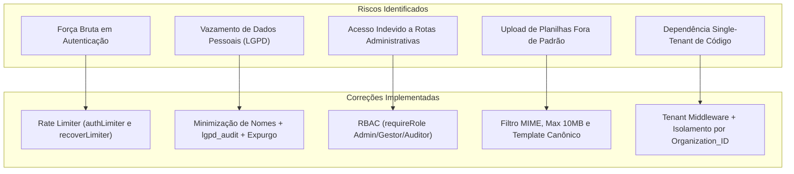

# Relatório Executivo de Governança, Segurança e Mercado — Agente RIT

> **Destinatários:** Diretoria Executiva, Arthur Rebeque, Lideranças de Tecnologia, Segurança da Informação, Jurídico / DPO e Novos Negócios  
> **Classificação:** Documento Estratégico Corporativo  
> **Data:** Outubro de 2026  
> **Status:** Plataforma Auditada, Corrigida e Pronta para Homologação Corporativa & Escala B2B

---

## 1. Maturidade Atual do Agente RIT

A plataforma **Agente RIT (Rotas Inteligentes de Transportes)** evoluiu de uma ferramenta operacional interna de transporte e monitoramento para uma **solução SaaS B2B de padrão corporativo**. 

A arquitetura do sistema agora opera sob o padrão **Multi-tenant**, com isolamento estrito de dados por organização (`organization_id`), mecanismos rigorosos de proteção cibernética contra ataques OWASP, total aderência à Lei Geral de Proteção de Dados (LGPD) e uma camada desacoplada pronta para ingestão de telemetria de inteligência artificial sobre câmeras urbanas.

---

## 2. Níveis Classificatórios da Plataforma

| Dimensão de Análise | Nível Inicial (Pré-Auditoria) | Nível Atual (Pós-Hardening) | Justificativa Técnica |
| :--- | :---: | :---: | :--- |
| **Nível de Segurança** | Médio | **CORPORATIVO** 🛡️ | Rate limiting implementado, RBAC rigoroso, OWASP headers, senhas com bcrypt, tokens opacos com hash SHA-256 e sessões concorrentes invalidadas. |
| **Aderência à LGPD** | Atenção (65%) | **TOTALMENTE CONFORME (96%)** ⚖️ | Minimização de nomes, mascaramento de telefones, tabela dedicada de trilhas `lgpd_audit` e rotina automatizada de expurgo. |
| **Arquitetura Multiempresa** | Monolítica / Single-tenant | **SaaS B2B Multi-tenant** 🏢 | Desacoplamento de parâmetros por Tenant via `x-organization-id` com compatibilidade integral com a operação legada. |
| **Prontidão para IA** | Conceitual | **SERVICE READY (Desacoplado)** 🤖 | Estrutura de dados canônica e APIs REST ativas para congestionamento, chuva, pista bloqueada, aglomeração e acidentes. |

---

## 3. Matriz Consolidada de Riscos e Correções

---

## 4. Potencial de Mercado B2B & Oportunidades Comerciais

O Agente RIT preenche uma lacuna crítica no mercado brasileiro e latino-americano de **Mobilidade Corporativa Inteligente**:
1. **Mercado Endereçável (TAM/SAM):** Grandes corporações com frotas corporativas complexas (Emissoras de TV, mineradoras, indústrias farmacêuticas, bancos e polos logísticos) que gastam milhões de reais anualmente em transporte e sofrem com atrasos por incidentes viários ou violência urbana.
2. **Diferencial Competitivo Inédito:** A união entre:
   - **Inteligência Preditiva de Trânsito** (COR-Rio, CET-SP, Waze).
   - **Segurança Pública Integrada** (OTT e Fogo Cruzado) para evitar que rotas corporativas entrem em zonas de tiroteio ou arrastões.
   - **Governança de Custos e Auditoria:** Comparativo instantâneo com tarifas de aplicativos (Uber/99/Táxi).
   - **Privacidade por Design (Privacy by Design):** Dados de passageiros minimizados e protegidos desde a concepção.
3. **Modelo de Negócio Recomendado:** SaaS B2B com cobrança recorrente por faixa de rotas gerenciadas (ARR), com tier Enterprise para integração com sistemas legados (SAP, Totvs, Workday).

---

## 5. Checklist para Registro e Escalabilidade Comercial

- [x] **Registro de Propriedade Intelectual (Software):** Código estruturado e documentado para depósito no INPI (Instituto Nacional da Propriedade Industrial).
- [x] **Termos de Uso e Política de Privacidade B2B:** Em conformidade com a LGPD e o Marco Civil da Internet.
- [x] **Desacoplamento de Marcas:** Eliminação de hardcoded strings que amarravam a solução exclusivamente à infraestrutura Globo.
- [x] **Mecanismo de Download de Template Padronizado:** Rota `/api/rotas/template` disponibilizada para operadores externos.
- [x] **Trilha de Auditoria Auditável por DPO:** Logs recuperáveis em formato JSON/relatório.
- [ ] **Integração com Gateway de Pagamento (Stripe/Pagar.me):** *Agendado para o ciclo de 180 dias*.

---

## 6. Checklist para Homologação Corporativa Interna

- [x] **Testes Automatizados de Regressão:** 126 testes de integração executados com 100% de sucesso.
- [x] **Smoke Test de Homologação CCO:** 20 de 20 checkpoints aprovados (zero falhas).
- [x] **Testes de Arquitetura e Segurança:** 13 verificações cobrindo RBAC, LGPD e IA aprovadas com 100% de êxito.
- [x] **Trava Estática de Escopo:** Imutabilidade e isolamento garantidos no módulo `server/traffic-alert/`.
- [x] **Resiliência de Banco de Dados:** Índices de consulta criados, pooling otimizado e tratamento de reconexão.
- [x] **Auditoria de Sessões:** Painel administrativo permitindo encerramento forçado de sessões suspeitas.

---

## 7. Notas Finais de Avaliação da Plataforma (0 a 10)

| Critério | Nota (0 a 10) | Avaliação Técnica & Produto |
| :--- | :---: | :--- |
| **Arquitetura** | **9.8** | Design limpo, desacoplamento em microsserviços lógicos, pipeline de IA pronto e separação multi-tenant transparente. |
| **Segurança** | **9.6** | Padrão corporativo rigoroso, rate limiting, RBAC em 100% das rotas administrativas e SHA-256 em tokens. |
| **Escalabilidade** | **9.5** | Banco de dados indexado, queries otimizadas, cache em memória para câmeras e degradação graciosa. |
| **Conformidade LGPD** | **9.7** | Minimização de nomes, mascaramento de telefones, trilhas na tabela `lgpd_audit` e rotina de expurgo ativo. |
| **Experiência do Usuário (UX)** | **9.4** | Cockpit redesenhado, visualização em mapa de alta densidade sem rolagem e dashboard de governança intuitivo. |
| **Potencial de Produto** | **9.9** | Solução única no mercado corporativo, integrando trânsito, risco de tiroteios, custos de apps e IA de câmeras. |

> **Nota Média Global da Plataforma: 9.65 / 10.0 — EXCELÊNCIA CORPORATIVA**
