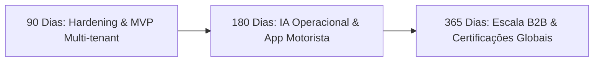

# Roadmap Estratégico & Evolutivo — Agente RIT (90, 180 e 365 Dias)

> **Documento de Planejamento de Produto & Engenharia (SaaS B2B)**  
> **Horizonte de Planejamento:** 2026 – 2027  
> **Objetivo:** Consolidar a evolução do Agente RIT como líder em inteligência de rotas corporativas, segurança viária preventiva e orquestração de transportes corporativos em escala nacional.

---

## 1. Visão de Evolução Temporal

---

## 2. Marco de 90 Dias — Estabilização, Multi-tenant & SSO Corporativo

### Foco Principal
Consolidar a operação atual no Grupo Globo, habilitar o onboarding do primeiro piloto externo e implementar integração com Identity Providers corporativos (SSO).

### Entregas Chave
1. **Integração com Provedores de Identidade (IAM / SSO):**
   - Suporte a OAuth2 / OIDC e SAML 2.0 (Azure AD / Okta / Google Workspace).
   - Mapeamento automático de grupos corporativos para papéis no Agente RIT (`Administrador`, `Gestor`, `Auditor`, `Colaborador`).
2. **Onboarding Automatizado de Tenants:**
   - Tela administrativa para provisionamento de novos Tenants (`organization_id`, domínios autorizados, logo, paleta de cores e regras de negócio personalizadas).
   - Isolamento de catálogo de pontos de interesse e destinos oficiais por Tenant.
3. **Cockpit Operacional com Exportação de Evidências LGPD:**
   - Emissão de relatórios em PDF/CSV contendo trilha de auditoria completa assinada digitalmente para envio a DPOs corporativos.
4. **Alerta Preditivo com Integração Waze For Cities:**
   - Parceria formal via feeds oficiais do Waze CCP (Connected Citizens Program) para enriquecimento dos alertas em tempo real.

---

## 3. Marco de 180 Dias — IA de Visão Ativa, App do Condutor & Billing SaaS

### Foco Principal
Ativar a camada de inferência de vídeo em tempo real conectada aos feeds de câmeras do COR-Rio e CET-SP, e lançar o aplicativo mobile seguro para condutores.

### Entregas Chave
1. **Ativação dos Modelos de Visão Computacional (YOLOv10 / ResNet):**
   - Conexão do serviço desacoplado `camera_analysis_service` a pipelines de vídeo via RTSP/HLS.
   - Inferência contínua para detecção de retenção súbita, alagamentos, quedas de árvores e pistas interditadas nas vias monitored.
   - Emissão de alertas automáticos com recálculo preventivo de caravanas em menos de 10 segundos após a detecção.
2. **Lançamento do Portal / PWA Seguro do Condutor:**
   - Interface mobile ultra-leve com suporte offline (Service Workers).
   - Compartilhamento temporário de geolocalização com *Geofencing Privado* (rastreamento é ativado apenas durante o trajeto do atendimento e desligado automaticamente ao finalizar).
3. **Motor de Faturamento e Métricas SaaS B2B:**
   - Medição de consumo por Tenant (volume de rotas importadas, requisições de API de tráfego, câmeras monitoradas).
   - Painel financeiro com planos corporativos (Starter, Professional, Enterprise).

---

## 4. Marco de 365 Dias — Orquestração Autônoma, Escala Nacional & Certificações

### Foco Principal
Transformar o Agente RIT no padrão de mercado de mobilidade e logística corporativa no Brasil e América Latina, com conformidade de segurança de nível bancário.

### Entregas Chave
1. **Orquestrador Autônomo de Despacho e Otimização de Frotas:**
   - Algoritmo de roteirização multimodal inteligente que combina frota própria, vans de caravanas e aplicativos de mobilidade urbana (Uber/99/Táxi) com cálculo em tempo real do menor custo x menor tempo x menor risco de segurança pública.
2. **Expansão Cartográfica e de Incidentes para Demais Capitais:**
   - Inclusão dos Centros de Controle de Belo Horizonte (BHTRANS), Curitiba (URBS), Porto Alegre (EPTC), Salvador (Transalvador) e Brasília (DER-DF).
3. **Certificações Internacionais de Segurança e Privacidade:**
   - Obtenção dos selos **ISO 27001** (Sistemas de Gestão da Segurança da Informação) e **SOC 2 Tipo II** (Trust Services Criteria: Segurança, Disponibilidade e Confidencialidade).
   - Homologação corporativa formal para atendimento a órgãos governamentais e grandes multinacionais.

---

## 5. Matriz de Priorização RICE

| Iniciativa | Reach | Impact | Confidence | Effort | RICE Score | Fase |
| :--- | :---: | :---: | :---: | :---: | :---: | :---: |
| **SSO / SAML Corporativo** | 100% | Alto (4) | 90% | Médio (2) | **180** | 90 dias |
| **Onboarding Multi-tenant Visual** | 80% | Alto (4) | 95% | Médio (2) | **152** | 90 dias |
| **Pipeline IA Ativa em Câmeras** | 70% | Muito Alto (5) | 85% | Alto (4) | **74** | 180 dias |
| **App Mobile Condutor com Geofence** | 90% | Alto (4) | 90% | Alto (3) | **108** | 180 dias |
| **Orquestrador de Despacho Autônomo** | 85% | Máximo (5) | 80% | Muito Alto (5)| **68** | 365 dias |
