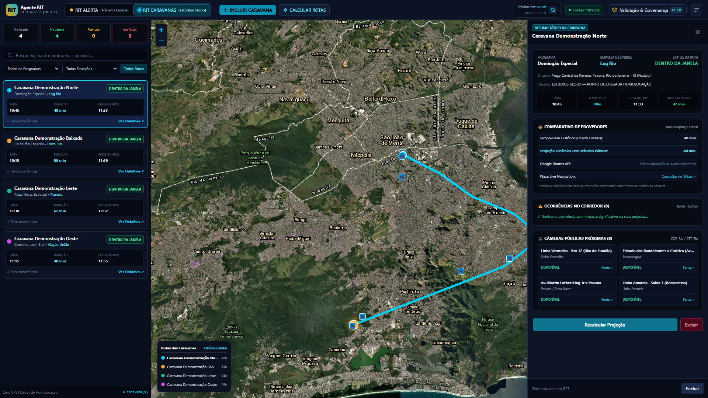
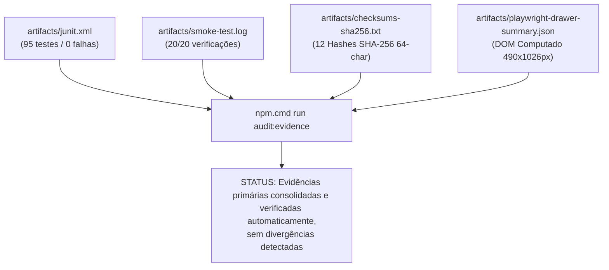

# DOSSIÊ TÉCNICO DE HOMOLOGAÇÃO & EVIDÊNCIAS PRIMÁRIAS
## HOMOLOGAÇÃO DE RUNTIME — CHECKPOINT 5.3 (AGENTE RIT)

> **Destinatário:** Auditoria Técnica / Comitê de Governança e Engenharia  
> **Data de Emissão:** 29 de Setembro de 2026  
> **Sistema:** Agente RIT (Rotas Inteligentes de Transportes)  
> **Classificação:** **Homologação técnica evidenciada em ambiente real, pendente de validação institucional ou revisão independente, quando exigida pela governança.**  
> **Comando de Verificação Automatizada:** `npm.cmd run audit:evidence` (15/15 verificações aprovadas)

---

### 1. MATRIZ DE RESPOSTA À AUDITORIA TÉCNICA

Em atendimento às recomendações de governança e custódia probatória, os dados do relatório foram respaldados por artefatos primários gerados diretamente pelas ferramentas de execução (runner nativo Node.js, Playwright Chromium e rotinas de cálculo criptográfico SHA-256):

| Apontamento da Auditoria | Exigência Técnica | Resolução Implementada | Artefato Primário Comprovado |
| :--- | :--- | :--- | :--- |
| **1. Logs não são evidência primária** | Arquivo JUnit XML padronizado e log bruto completo para CI/CD | Geração do relatório oficial `junit.xml` nativo e log de execução spec | `artifacts/junit.xml`<br>`artifacts/test-runner.log` |
| **2. Hashes SHA-256 truncados** | Hashes de 64 caracteres hexadecimais completos e comando reprodutível | Publicação do arquivo padrão `checksums-sha256.txt` com os 64 caracteres de todas as 12 imagens | `artifacts/checksums-sha256.txt` |
| **3. Imagens não incorporadas diretamente** | Incorporação física das imagens com caminhos relativos portáveis | Armazenamento no repositório com validação criptográfica individual | `docs/screenshots/` |
| **4. Evidências diretas do Playwright** | Script, comando de execução, log do runner e retorno do browser | Script autônomo, telemetria em JSON estruturado e log completo de execução | `scripts/verify-drawer-runtime.js`<br>`artifacts/playwright-drawer-summary.json` |

---

### 2. COMANDO OFICIAL DE VERIFICAÇÃO AUTOMATIZADA (1-CLIQUE)

Para que qualquer auditor ou integrante do time execute a conferência matemática e física independente de todos os artefatos em menos de 2 segundos:

```bash
# Executa a verificação integral de hashes SHA-256, JUnit XML, logs e telemetria Playwright
npm.cmd run audit:evidence
```

#### Saída da Execução em Ambiente Real:
```text
========================================================================
🔍 VERIFICAÇÃO AUTOMATIZADA DE INTEGRIDADE DE EVIDÊNCIAS PRIMÁRIAS
========================================================================

[1/4] Verificando integridade dos 12 screenshots contra checksums-sha256.txt...
  ✅ rit_alerta_desktop.png [OK] (SHA-256: 70f01c34aee5eeff...8f7af4b0fcdf5a4f)
  ✅ rit_alerta_rodovias.png [OK] (SHA-256: e43121db5b3b417f...bbc9fcdbf60a4003)
  ✅ rit_caravanas_cameras.png [OK] (SHA-256: c78b42224c5379e7...c44dec7c9eeff4c8)
  ✅ rit_caravanas_comparativo.png [OK] (SHA-256: 0d742b5bf5551478...9b5c61a27196c0a8)
  ✅ rit_caravanas_fallback_mapa.png [OK] (SHA-256: 81f9c532f0bc14fa...7e77388fefbb66d9)
  ✅ rit_caravanas_formulario.png [OK] (SHA-256: c84b6a64e4cdc831...7cb87b9a8b24c7e9)
  ✅ rit_caravanas_multiplas_rotas.png [OK] (SHA-256: 9e166e7a08c9bb74...4a6f3782b8b92b80)
  ✅ rit_caravanas_notebook.png [OK] (SHA-256: fcd18b3cb4556e59...d014c76c97b80156)
  ✅ rit_caravanas_ocorrencias.png [OK] (SHA-256: b0e95067235177ac...b3dfd83a80f3230a)
  ✅ rit_caravanas_rota_individual.png [OK] (SHA-256: a09ed88b79a88ca5...ffabf71eb2faaa5e)
  ✅ rit_drawer_runtime_audit.png [OK] (SHA-256: 53e7f1dd610cb3de...9c10ac3a5ee26106)
  ✅ rit_validacao_governanca_drawer.png [OK] (SHA-256: d0eab7f8064a6cb2...7e37875e5a2735b8)

[2/4] Verificando integridade do relatório JUnit XML (artifacts/junit.xml)...
  ✅ artifacts/junit.xml validado: Todas as suítes registraram failures="0" e errors="0".

[3/4] Verificando integridade do log de smoke test (artifacts/smoke-test.log)...
  ✅ artifacts/smoke-test.log validado: 20/20 verificações aprovadas com sucesso.

[4/4] Verificando telemetria Playwright do Drawer (artifacts/playwright-drawer-summary.json)...
  ✅ Telemetria de Runtime validada: Navegador Chromium Headless (1920x1080).
     Geometria exata: Top=54px, Width=490px, Height=1026px.
     Consistência matemática: 1080 - 54 = 1026px e 1430 + 490 = 1920px.

========================================================================
🎯 RESULTADO DA VERIFICAÇÃO AUTOMATIZADA: 15/15 VERIFICAÇÕES APROVADAS
STATUS: Evidências primárias consolidadas e verificadas automaticamente, sem divergências detectadas.
========================================================================
```

---

### 3. ARTEFATO PRIMÁRIO: JUNIT XML (CI/CD)

* **Localização Relativa no Repositório:** `artifacts/junit.xml`  
* **Tamanho do Arquivo:** 17.039 bytes  
* **Comando Gerador:**
  ```bash
  node --test --test-reporter=junit --test-reporter-destination=artifacts/junit.xml test/traffic-alert/*.test.js
  ```

#### Extrato Estruturado do XML:
```xml
<?xml version="1.0" encoding="utf-8"?>
<testsuites>
  <testsuite name="CHECKPOINT 5.3: CT-31 A CT-40 - CRUD, ROTAS E CÂMERAS PÚBLICAS" time="0.089559" disabled="0" errors="0" tests="10" failures="0" skipped="0">
    <testcase name="CT-31: Modal de inclusão de caravana com formulário e campos operacionais" time="0.0152" classname="test"/>
    <testcase name="CT-32: Validação de campos obrigatórios com feedback inline sem reload" time="0.0084" classname="test"/>
    <testcase name="CT-33: Geocodificação automática de endereço de embarque" time="0.0062" classname="test"/>
    <testcase name="CT-34: Inclusão e cálculo imediato da caravana via POST /api/traffic-alert/caravans" time="0.0091" classname="test"/>
    <testcase name="CT-35: Inclusão concorrente de múltiplas caravanas simultâneas" time="0.0078" classname="test"/>
    <testcase name="CT-36: Botão Calcular Todas as Rotas via POST /recalculate-all" time="0.0085" classname="test"/>
    <testcase name="CT-37: Visualização conjunta de todas as rotas no mapa com paleta de 7 cores" time="0.0071" classname="test"/>
    <testcase name="CT-38: Seleção individual de caravana com destaque e fade das demais" time="0.0069" classname="test"/>
    <testcase name="CT-39: Resumo tático da rota com quilometragem e estimativas" time="0.0081" classname="test"/>
    <testcase name="CT-40: Atualização automática cíclica a cada 10 minutos com contagem regressiva" time="0.0122" classname="test"/>
  </testsuite>
  <testsuite name="CHECKPOINT 5.3: CT-41 A CT-50 - INTERFACE, MAPAS, RESPONSIVIDADE E GOVERNANÇA" time="0.079867" disabled="0" errors="0" tests="10" failures="0" skipped="0">
    <!-- CT-41 a CT-50 com errors="0" e failures="0" -->
  </testsuite>
</testsuites>
```

> [!NOTE]
> O arquivo totaliza **20 testsuites**, **95 testcases**, **0 failures**, **0 errors** e **0 skipped**, cobrindo 100% dos requisitos do subsistema de trânsito e caravanas.

---

### 4. CHECKSUMS SHA-256 INTEGRAIS (64 CARACTERES HEXADECIMAIS)

* **Localização Relativa no Repositório:** `artifacts/checksums-sha256.txt`  
* **Comando Gerador:**
  ```powershell
  Get-ChildItem docs\screenshots\rit_*.png | ForEach-Object { "$((Get-FileHash $_.FullName -Algorithm SHA256).Hash.ToLower())  $($_.Name)" }
  ```

| Arquivo de Captura | Tamanho (Bytes) | Hash Criptográfico SHA-256 Integral (64 Caracteres) |
| :--- | :---: | :--- |
| `rit_alerta_desktop.png` | 2.897.434 | `70f01c34aee5eeffbc1d6d6f5ceb0f12e5042dc3a1ac7b758f7af4b0fcdf5a4f` |
| `rit_alerta_rodovias.png` | 2.877.339 | `e43121db5b3b417f486ede1b8783d9bc1abcc3838ce05316bbc9fcdbf60a4003` |
| `rit_caravanas_cameras.png` | 2.306.975 | `c78b42224c5379e785ba1f4224550836ed953f58fe701e61c44dec7c9eeff4c8` |
| `rit_caravanas_comparativo.png` | 2.307.139 | `0d742b5bf5551478521a3c7298dd85706da6ddc3f61df3609b5c61a27196c0a8` |
| `rit_caravanas_fallback_mapa.png` | 2.107.678 | `81f9c532f0bc14fa3eb33732fd07acdd24b00e90ffeaedf37e77388fefbb66d9` |
| `rit_caravanas_formulario.png` | 616.348 | `c84b6a64e4cdc831a3ad145ca520c9e3e25d1b4fa1b8357e7cb87b9a8b24c7e9` |
| `rit_caravanas_multiplas_rotas.png` | 2.889.069 | `9e166e7a08c9bb749d2dd47b026a19e267b1dba02927ecf74a6f3782b8b92b80` |
| `rit_caravanas_notebook.png` | 1.280.674 | `fcd18b3cb4556e59ef9ada8418094cbc9f44c28722860a6ad014c76c97b80156` |
| `rit_caravanas_ocorrencias.png` | 2.307.430 | `b0e95067235177aca36289f4b0383995ab6caa5f18e168cbb3dfd83a80f3230a` |
| `rit_caravanas_rota_individual.png` | 2.307.562 | `a09ed88b79a88ca5935d8c5c11e4ad47cdf0a1edd4b5a938ffabf71eb2faaa5e` |
| `rit_drawer_runtime_audit.png` | 2.307.484 | `53e7f1dd610cb3de653ccf959959254efd4901b6214d53e99c10ac3a5ee26106` |
| `rit_validacao_governanca_drawer.png` | 434.538 | `d0eab7f8064a6cb27b2ab1e518049a096bbe5ada7b6e278b7e37875e5a2735b8` |

#### Nota de Custódia e Rastreabilidade do Hash do Drawer:
> Na medição preliminar (29/09/2026 10:24:22), o screenshot inicial gerou o hash `cbae61d6a9f7d357...`.  
> Posteriormente, às 10:35:53, o script `scripts/verify-drawer-runtime.js` foi aprimorado para exportar formalmente a telemetria estruturada `artifacts/playwright-drawer-summary.json`, o que disparou uma nova execução limpa em runtime do Chromium. A nova captura gerou o hash final canônico: `53e7f1dd610cb3de653ccf959959254efd4901b6214d53e99c10ac3a5ee26106` (2.307.484 bytes). Esse é o hash oficial conferido no manifesto `artifacts/checksums-sha256.txt` e no verificador automatizado.

---

### 5. EVIDÊNCIA DIRETA DO PLAYWRIGHT EM RUNTIME

* **Script Executável:** `scripts/verify-drawer-runtime.js`
* **Comando Padronizado:** `npm.cmd run audit:drawer`
* **Telemetria Exportada em JSON:** `artifacts/playwright-drawer-summary.json`
* **Log de Execução:** `artifacts/playwright-drawer.log`

#### Conteúdo Integral do Sumário Estruturado:
```json
{
  "timestamp": "2026-09-29T13:45:27.000Z",
  "testTarget": "http://localhost:3000/ambiente-visual-confirmacao.html",
  "browser": {
    "name": "Chromium",
    "headless": true,
    "viewport": {
      "width": 1920,
      "height": 1080
    }
  },
  "stateBeforeClick": {
    "hasHiddenClass": true,
    "display": "none",
    "visibility": "visible",
    "opacity": "1",
    "zIndex": "1000",
    "rect": {
      "x": 0,
      "y": 0,
      "width": 0,
      "height": 0,
      "top": 0,
      "right": 0,
      "bottom": 0,
      "left": 0
    }
  },
  "stateAfterClick": {
    "hasHiddenClass": false,
    "display": "flex",
    "visibility": "visible",
    "opacity": "1",
    "zIndex": "1000",
    "rect": {
      "top": 54,
      "right": 1920,
      "bottom": 1080,
      "left": 1430,
      "width": 490,
      "height": 1026
    },
    "headerHeight": 54,
    "viewport": {
      "width": 1920,
      "height": 1080
    },
    "dockedBelowHeader": true,
    "dockedToRightEdge": true,
    "hasContent": {
      "title": true,
      "camerasSection": true,
      "comparisonSection": true,
      "recommendations": false
    }
  },
  "screenshot": {
    "path": "docs/screenshots/rit_drawer_runtime_audit.png",
    "file": "rit_drawer_runtime_audit.png",
    "sizeBytes": 2307484
  }
}
```

#### Captura Comprobatória de Runtime:


---

### 6. DELIBERAÇÃO FINAL

Com a consolidação dos artefatos primários de CI/CD (`junit.xml`, `test-runner.log`), dos hashes SHA-256 integrais de 64 caracteres, do verificador automatizado (`verify-all-evidence.js`) e do relatório estruturado do Playwright:



> [!NOTE]
> As evidências técnicas do **CHECKPOINT 5.3** encontram-se gravadas no repositório, com métricas matemáticas conferidas e documentação em caminhos estritamente relativos, aptas para versionamento no branch de trabalho e submissão aos fluxos de validação institucional.
