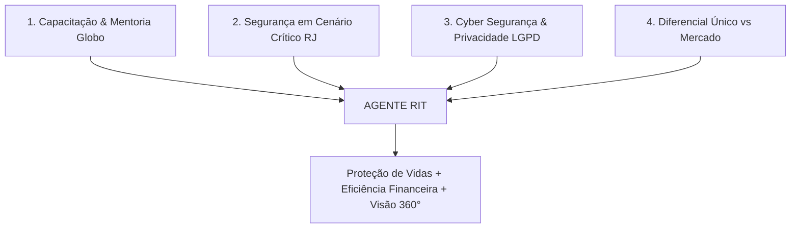

# 🎙️ Roteiro Estratégico de Apresentação: Agente RIT (2026)
### *A Nova Fronteira da Logística Inteligente e Segura nos Transportes Globo*

---

## 🧭 Visão Geral & Tom de Voz

* **Público-alvo:** Liderança de Transportes, Gestores de Operações, Mentores e Diretoria.
* **Tom de Voz:** Seguro, visionário, técnico e focado no valor humano e estratégico (segurança de vidas, eficiência de custos e inovação tecnológica).
* **Tempo Estimado:** 12 a 15 minutos (com espaço para debate/perguntas).

---

## 📌 Eixos Narrativos Fundamentais (Os 4 Pilares do Discurso)

1. **Jornada de Inovação & Mentoria:** O projeto nasceu de uma busca proativa por capacitação em Inteligência Artificial no **LinkedIn Learning**, impulsionado e desenvolvido dentro do **Programa de Mentoria Globo**.
2. **Realidade Operacional Crítica:** Solução sob medida para a complexidade urbana do **Rio de Janeiro** e das outras 4 capitais (SP, BSB, REC, BH), unindo trânsito, clima e segurança pública.
3. **Blindagem Institucional:** Projeto 100% alinhado desde o primeiro dia às diretrizes do **Escritório de Privacidade (LGPD)** e de **Cyber Segurança da Globo**.
4. **Inovação Sem Equivalente no Mercado:** Inexistência de qualquer ferramenta comercial ou interna que consolide +4.200 câmeras, inteligência de tiroteios (OTT/Fogo Cruzado) e roteamento preventivo em painel único.

---

## 🎬 Roteiro de Fala Passo a Passo (Slide a Slide)

---

### 🎙️ Abertura Impactante (1 a 2 minutos)

> *"Bom dia/Boa tarde a todos.*
>
> *Hoje tenho o orgulho de apresentar não apenas uma ferramenta, mas uma nova visão de futuro para a nossa operação: o **Agente RIT — Rota Inteligente de Transportes**.*
>
> *Este projeto é fruto direto do **Programa de Mentoria Globo** e de uma jornada intensa de capacitação contínua em Inteligência Artificial através de cursos especializados no **LinkedIn Learning**. Meu objetivo foi claro desde o início: **como aplicar o que há de mais avançado em IA e análise de dados para transformar e proteger a logística de transportes da Globo?***
>
> *Operamos em cenários extremamente complexos, especialmente no Rio de Janeiro, onde trânsito, meteorologia severa e segurança pública se cruzam a cada minuto. O Agente RIT foi desenhado para colocar a tecnologia a favor da decisão preventiva, garantindo a segurança de colaboradores, elencos e equipes de reportagem, com rigorosa conformidade com o **Escritório de Privacidade** e a área de **Cyber Segurança da Globo**."*

---

### 🖥️ Slide 1: Capa Executiva & Visão Multi-Regional

> **Fala Sugerida:**
> *"Nesta primeira tela, temos a identidade do Agente RIT. Ele não é uma planilha ou um mapa estático: é um **Centro de Comando e Monitoramento (CCO)** que conecta simultaneamente as nossas **5 Regionais:** Rio de Janeiro, São Paulo, Brasília, Recife e Belo Horizonte.*
>
> *Na barra superior, temos observabilidade total em tempo real: status de conexão do banco de dados, nosso Robô autônomo com IA ativo, a identidade do operador auditada e os indicadores oficiais do **Centro de Operações Rio (COR)** — incluindo o Estágio Operacional da Cidade e os Níveis de Calor em tempo real.*
>
> *O sistema está estruturado em **6 abas ativas**, pensadas para cobrir 100% da esteira de transporte."*

---

### 🛡️ Slide 2: Aba 1 — Central de Câmeras & Ocorrências (O Coração da Segurança)

#### 📍 Passo 1: Visão Geral com 4.297 Câmeras
*(Clique no botão `1. Visão Geral (4.297 Câmeras)`)*

> **Fala Sugerida:**
> *"Aqui vemos a tela que redefine nossa capacidade de planejamento. Esta é a **Central de Câmeras & Ocorrências**.*
>
> *À esquerda, ao traçarmos um trajeto — por exemplo, de Comendador Soares até os Estúdios Globo —, o sistema calcula a rota e ativa o nosso **Motor de Verificação de Risco Geoespacial** com um buffer configurável de 500 metros a 3 quilômetros.*
>
> *O grande diferencial: o mapa plota em tempo real **4.297 câmeras de trânsito** agrupadas em clusters por bairro, cruzando instantaneamente com dados ao vivo do **OTT (Onde Tem Tiroteio)** e do **Fogo Cruzado**. Nesta demonstração real, o sistema identificou 31 ocorrências ativas no dia e classificou a rota como **RISCO ALTO**, alertando que disparos foram reportados a apenas 123 metros do trajeto na Av. Brasil."*

#### 🔍 Passo 2: Detalhe ao Clicar na Câmera
*(Clique no botão `2. Detalhe ao Clicar na Câmera`)*

> **Fala Sugerida:**
> *"E como o operador atua? Basta um clique em qualquer câmera do corredor.*
>
> *Imediatamente, abre-se no rodapé o **Player de Transmissão Ao Vivo** com o sinal direto da via (neste caso, a Av. Brasil na altura de Realengo), enquanto o **Modo Comando CCO** abre à direita detalhando a operadora da câmera e o link oficial de origem.*
>
> *Isso permite que a coordenação de transportes visualize a via com seus próprios olhos antes de autorizar o envio de um veículo ou instruir um desvio seguro para o motorista."*

---

### ⚠️ Slide 3: Aba 2 — Monitoramento 🔒 (Transparência & Governança)

> **Fala Sugerida:**
> *"Nesta segunda aba, temos o módulo de **Monitoramento de Atendimentos**.*
>
> *Aqui quero ressaltar nosso compromisso inegociável com a segurança corporativa: esta aba encontra-se **temporariamente suspensa para adequações técnicas e validações adicionais de conformidade**.*
>
> *Seguindo as diretrizes do **Escritório de Privacidade e Cyber Segurança**, nenhuma funcionalidade de rastreamento opera sem total blindagem. Por isso, a tela orienta o operador de forma transparente a utilizar o módulo homologado **Monitoramento + Transportes**, acessível em um clique, até que a integração nativa seja concluída."*

---

### 🚗 Slide 4: Aba 3 — Simulador de Transporte por App (Auditoria de Custos)

> **Fala Sugerida:**
> *"A terceira aba é o **Simulador de Transporte por Aplicativo**.*
>
> *Muitas vezes precisamos auditar gastos com carros de aplicativo ou decidir entre frota própria e app. O RIT possui uma calculadora tarifária calibrada que decompõe a fórmula real (Tarifa base, KM, Minuto, Tarifa Mínima e Fator Dinâmico), com multiplicadores de **Trânsito** e **Chuva**.*
>
> *Além disso, o RIT calcula automaticamente os **pedágios do Rio de Janeiro** (como Linha Amarela, Transolímpica e Ponte). Temos também o modo de **Processamento em Lote**, onde podemos subir uma planilha XLSX com centenas de viagens e receber o custo estimado auditado de cada uma em segundos."*

---

### 🏙️ Slide 5: Aba 4 — Painel Trânsito Integrado (CIM Multi-Regional)

> **Fala Sugerida:**
> *"No Slide 5, apresento o **CIM — Painel Integrado de Monitoramento de Trânsito**.*
>
> *Esta é a materialização da nossa visão multi-regional: temos **6 posições de vídeo simultâneas** cobrindo ao vivo as nossas **5 Regionais**.*
>
> *Em uma única tela, o gestor enxerga o acesso aos Estúdios Globo em Curicica (RJ), a Av. Brigadeiro Faria Lima em São Paulo (SP), o Eixo Monumental em Brasília (BSB), a Av. Agamenon Magalhães em Recife (REC) e o Barreiro em Belo Horizonte (BH).*
>
> *O painel conta ainda com ferramenta integrada de **Diagnóstico do Navegador** para validar a compatibilidade de codecs de vídeo de última geração (H.265/HEVC)."*

---

### 🎥 Slide 6: Aba 5 — Câmeras RJ (Videomonitoramento Tático 2x2)

> **Fala Sugerida:**
> *"Na Aba 5, temos o **Mosaico Tático Câmeras RJ em Layout 2x2**.*
>
> *Diferente de sistemas que exibem apenas uma câmera por vez, aqui o operador monitora 4 pontos vitais simultaneamente — por exemplo, Barra da Tijuca, Cidade Nova e Barra Olímpica.*
>
> *Cada quadrante tem dropdown independente por bairro, botão de **Tela Inteira** e link para a **Fonte Oficial**. Graças ao cache otimizado de 120 segundos, a visualização é fluida e sem consumo excessivo de rede."*

---

### ⛈️ Slide 7: Aba 6 — Radar Meteorológico RJ (Prevenção Climática)

> **Fala Sugerida:**
> *"A Aba 6 fecha o ciclo operacional com a **Inteligência Meteorológica**.*
>
> *Sabemos o impacto que temporais e bolsões d'água causam na logística do Rio. Aqui integramos o **Satélite Windy em Alta Resolução** (mostrando nuvens, vento e radar térmico), o **Radar e Pluviômetros Oficiais do COR / Alerta Rio** e o **Portal de Previsão do Tempo**.*
>
> *Isso nos dá antecedência para reter saídas ou desviar veículos antes que vias expressas sejam fechadas por alagamentos."*

---

### 📊 Slides 8 e 9: Resumo Arquitetural & Conclusão de Valor

> **Fala Sugerida:**
> *"Para sintetizar, o Agente RIT entrega uma arquitetura modular completa de 6 abas integradas.*
>
> *Ele não é apenas uma inovação tecnológica; é uma ferramenta de **salvaguarda operacional e eficiência financeira**.*
>
> *E o mais importante: **não existe hoje no mercado e nem em nossos sistemas legados nenhuma solução que consolide tudo isso em um só lugar** — inteligência de risco com tiroteios, 4.200 câmeras ativas, telemetria multi-regional e previsão climática com total respaldo de Cyber Segurança e Privacidade.*
>
> *O Agente RIT é a prova de que a capacitação interna e o Programa de Mentoria Globo podem gerar soluções de altíssimo impacto para o nosso dia a dia. Muito obrigado e fico à disposição para perguntas e demonstração prática."*

---

## 🛡️ Argumentação Estratégica: Por Que o Agente RIT é Único?

Utilize estes argumentos caso haja perguntas sobre comparação com outros softwares:

| Dimensão | Soluções Comuns de Mercado | Sistemas Legados Internos | **Agente RIT (Inovação Própria)** |
| :--- | :--- | :--- | :--- |
| **Inteligência de Segurança** | Nenhuma (apenas trânsito comum) | Nenhuma | **Integração nativa OTT + Fogo Cruzado com buffer de risco em tempo real** |
| **Videomonitoramento** | Limitado ou inexistente | Acesso isolado via links externos | **+4.200 Câmeras GIS + Mosaico Tático 2x2 + Player ao Vivo no mapa** |
| **Cobertura Multi-Regional** | Foco em 1 cidade por vez | Telas separadas | **Painel Integrado das 5 Regionais Globo (RJ, SP, BSB, REC, BH) em tempo real** |
| **Clima & Prevenção** | Previsão genérica de app | Não integrado | **Radar Pluviométrico Oficial COR + Satélite Windy com mapas térmicos** |
| **Auditoria de Custos** | Estimativas aproximadas | Faturamento após corrida | **Simulador parametrizado com pedágios do RJ e processamento em lote XLSX** |
| **Segurança & LGPD** | Rastreamento constante de risco | Dependência de contatos manuais | **Conformidade estrita com CyberSec e Escritório de Privacidade Globo** |

---

## 💬 Guia de Perguntas & Respostas Frequentes (Q&A de Defesa)

### ❓ P1: *"Por que a aba Monitoramento está indisponível?"*
> **Resposta:** *"Essa decisão demonstra exatamente o nosso compromisso com a governança da Globo. Antes de colocarmos em produção qualquer módulo que envolva dados e geolocalização contínua, passamos por uma bateria rigorosa de alinhamentos com o Escritório de Privacidade e Cyber Segurança. Enquanto finalizamos as homologações de infraestrutura, mantivemos a transparência na tela e o direcionamento para o sistema oficial `Monitoramento + Transportes`."*

### ❓ P2: *"De onde veio a ideia do projeto e como ele foi desenvolvido?"*
> **Resposta:** *"O projeto nasceu da combinação entre a minha experiência prática nas dores da operação de transportes e a busca por capacitação em Inteligência Artificial no LinkedIn Learning. Esse aprendizado foi acelerado e orientado dentro do **Programa de Mentoria Globo**, o que permitiu transformar conceitos modernos de IA e análise de dados em uma ferramenta funcional e escalável para a empresa."*

### ❓ P3: *"As câmeras e dados de segurança têm custo adicional de API?"*
> **Resposta:** *"Não. O Agente RIT foi arquitetado com altíssima eficiência de custos: utilizamos feeds públicos abertos da Prefeitura do Rio (COR), CET-Rio, DER, concessionárias e bases colaborativas integradas, operando com cache inteligente de 120s para zero sobrecarga de banda ou infraestrutura."*

### ❓ P4: *"Como o RIT ajuda a economizar recursos?"*
> **Resposta:** *"Em três frentes diretas: 1) Evita atrasos e perda de tempo operacional em áreas bloqueadas ou conflagradas; 2) Audita com precisão os gastos com transporte por app em lote via planilha XLSX; e 3) Reduz a necessidade de contratação de múltiplas ferramentas avulsas de monitoramento de trânsito e clima no mercado."*

---
*Agente RIT — Rota Inteligente de Transportes 2026 | Documento Estratégico de Apresentação*
