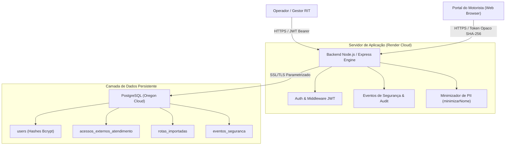
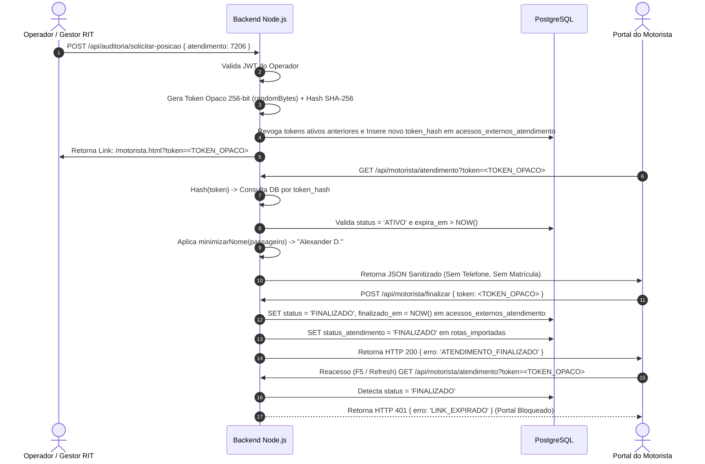

# Arquitetura de Segurança, Privacidade e Governança do Agente RIT – Baseline Corporativo Vigente

---

## 1. Sumário Executivo

O **Agente RIT** (Rota Inteligente de Transporte) é uma plataforma de apoio operacional desenvolvida para a gestão, auditoria, simulação e monitoramento de transportes da Globo. O sistema atua como ferramenta complementar de inteligência logística e rastreamento, mantendo a solução **+ Transportes** como a ferramenta oficial contratada e homologada corporativamente.

Este documento estabelece a **Especificação Técnica do Baseline Vigente de Segurança, Privacidade e Governança** do Agente RIT. Ele descreve a arquitetura atual, a infraestrutura blindada e os controles de cibersegurança ativos que garantem a proteção do banco de dados, a conformidade com a Lei Geral de Proteção de Dados (LGPD - Lei 13.709/2018) e o atendimento aos requisitos de auditoria do **Escritório de Privacidade (DPO)** e da **Diretoria de Cyber Security da Globo**.

### Estado Atual dos Controles de Segurança:
- **Tratamento Seguro de PII no Mapa e APIs:** O sistema opera sob o princípio de *Privacy by Default*. O nome do passageiro é minimizado compulsoriamente (ex: `"Alexander D."`), o endereço de deslocamento é protegido sob tokens temporários sem exposição em URLs e o contato telefônico é 100% omitido das respostas de APIs públicas do motorista.
- **Proteção Absoluta contra IDOR (BOLA):** URLs públicas do Portal do Motorista não utilizam identificadores numéricos ou sequenciais. O acesso é autenticado por **Tokens Opacos de Alta Entropia (SHA-256)** gerados dinamicamente por viagem.
- **Revogação Imutável Pós-Atendimento:** O token de acesso expira instantaneamente no banco PostgreSQL assim que o motorista aciona a finalização da viagem ou quando o limite de inatividade (30 minutos) é atingido. Reacessos posteriores recebem o código `HTTP 401 LINK_EXPIRADO`.
- **Isolamento de Inteligência em Runtime (Air-Gapped Privacy):** As operações de rota, consultas normativas e gestão de colaboradores são executadas 100% em infraestrutura interna. Nenhuma informação pessoal, geográfica ou operacional é transmitida para provedores ou APIs externas de Inteligência Artificial em tempo de execução.
- **Hardening e Defesa em Profundidade:** Proteção de segredos via variáveis de ambiente isoladas, consultas SQL parametrizadas imunes a SQL Injection, cabeçalhos HTTP de segurança (CSP, HSTS, X-Frame-Options) e auditoria estruturada na tabela `eventos_seguranca`.

---

## 2. Escopo e Limites do Sistema

### 2.1 Fronteiras da Aplicação e Infraestrutura
- **Ambiente de Hospedagem:** Render Cloud Service (Node.js / Express Enterprise Engine) em ambiente de execução isolado.
- **Armazenamento de Dados:** PostgreSQL Gerenciado em Nuvem (Render Cloud DB, Região Oregon), com criptografia compulsória de dados em trânsito (TLS 1.3 enforced).
- **Repositório de Código:** GitHub (Privado), restrito ao versionamento de código-fonte sanitizado, com bloqueio estrito de planilhas de RH, dumps de produção ou segredos.

### 2.2 Premissa Operacional vs. Ferramenta Oficial
| Componente | Papel no Ecossistema Corporativo | Regra de Governança e Compliance |
|---|---|---|
| **+ Transportes** | Ferramenta oficial contratada e homologada pela Globo. | Sistema primário de bilhetagem, faturamento e registros contratuais. |
| **Agente RIT** | Plataforma de teste operacional e apoio à gestão logístico-geográfica. | Plataforma complementar sandbox; armazena estritamente PII minimizada e dados de telemetria operacional. |

---

## 3. Matriz Comparativa — Evolução da Arquitetura de Segurança (Antes x Depois)

A tabela abaixo descreve a transição entre o estado legado de desenvolvimento e o **Baseline Vigente de Segurança** auditável:

| Domínio de Segurança / Dado | Estado Anterior (Legado / Vulnerável) | Arquitetura Vigente (Estado Atual de Segurança) |
|---|---|---|
| **Linguagem da Arquitetura** | Histórica / Changelog ("foi removido", "retirado"). | **Normativa e Operacional:** Descreve os controles ativos e como o sistema É seguro hoje. |
| **Nome Completo do Passageiro** | Exibido integralmente no Portal do Motorista e URLs (ex: `"Silvio Meira"`). | **Minimização Compulsória LGPD (Privacy by Default):** O backend entrega apenas o nome inicial abreviado (ex: `"Silvio M."`, `"Alexander D."`). |
| **Contato Telefônico do Passageiro** | Exibido na tela e retornado na API pública do motorista. | **Omissão Total (Zero-Trust Contact):** 100% omitido das APIs e telas do motorista. A comunicação é realizada exclusivamente via Central de Transportes. |
| **Endereço de Origem e Destino** | Exposto em URLs públicas sem controle de acesso. | **Proteção Geográfica Restrita:** Processado apenas no backend para roteamento de mapa e consumido sob Token Opaco temporário sem expor PII em URLs. |
| **Identificação da Corrida no Link** | ID numérico sequencial simples (`?id=7206`), permitindo enumeração/IDOR. | **Token Opaco SHA-256 de Alta Entropia:** A URL pública contém apenas hash hexadecimal único. Enumeração matematicamente impossível. |
| **Validade do Link do Motorista** | Links permaneciam ativos indefinidamente. | **Revogação Instantânea no DB:** Expiração automática ao clicar em "Finalizar Atendimento" ou por inatividade (30 min). Reacessos recebem `HTTP 401`. |
| **Processamento de Normas e Documentos** | Chamadas em tempo de execução para APIs de IA externas (Groq/LLM). | **Processamento Local Isolado (Zero Exfiltração):** Consultas de regras e bases operacionais são executadas estritamente em infraestrutura interna. Zero dados externos. |
| **Armazenamento de Senhas de Usuários** | Sem padronização de segurança corporativa. | **Criptografia Bcrypt Fator 10:** Hashes irreversíveis no PostgreSQL. Nenhuma senha trafega em texto claro. |
| **Trilha de Auditoria e Forense** | Logs sem padronização ou restrição de PII. | **Tabela `eventos_seguranca` e Logs Sanitizados:** Registro imutável no PostgreSQL com captura de IP e apenas os 8 caracteres iniciais de prefixo do token. |

---

## 4. Arquitetura Vigente do Sistema

O Agente RIT adota uma **Arquitetura em Camadas Segregadas (Decoupled Layered Architecture)** com comunicação criptografada via HTTPS/REST e protocolo TLS 1.3.



---

## 5. Princípios de Segurança e Privacidade

O Agente RIT opera sob cinco pilares fundamentais de cibersegurança:

1. **Privacy by Design & Privacy by Default (LGPD Art. 46):** A privacidade é a configuração padrão do sistema. Todas as APIs externas entregam dados minimizados na origem.
2. **Defesa em Profundidade (Defense-in-Depth):** Múltiplas camadas de proteção independentes (HTTPS, CORS, Rate Limit, JWT, Tokens Opacos, Hashes Bcrypt e Sanitização DOM).
3. **Princípio do Menor Privilégio (Least Privilege):** O Portal do Motorista recebe exclusivamente as coordenadas e a identificação minimizada do passageiro necessárias para a execução da viagem.
4. **Zero Confiança em Links Temporários (Zero Trust Token):** Links de acesso externo caducam no instante da conclusão do atendimento ou por atingimento de timeout.
5. **Isolamento de Inteligência Operacional:** Regras de transporte e roteamento são processadas localmente, sem dependência de serviços externos.

---

## 6. Tratamento de PII e Dados do Mapa de Transporte

O Agente RIT estabelece regras rigorosas de tratamento para os dados operacionais e pessoais dos passageiros:

### 6.1 Tratamento do Nome Completo do Passageiro
> **STATUS ATUAL:**  
> O Agente RIT aplica o princípio de Minimização de Dados (LGPD Art. 6º, III) na camada de serviço do backend (`minimizarNome()`). A aplicação reduz compulsoriamente os nomes de passageiros para o primeiro nome seguido da inicial do sobrenome (ex: `"Alexander D."`). O banco de dados armazena o nome estritamente para conciliação operacional interna, mas os payloads retornados para interfaces externas jamais contêm o nome completo do colaborador.

### 6.2 Tratamento do Endereço de Origem e Destino no Mapa
> **STATUS ATUAL:**  
> Os dados de localização e endereço são utilizados exclusivamente para a renderização das rotas e cálculo de deslocamento no mapa do Agente RIT. No Portal do Motorista, os pontos de embarque e desembarque são associados unicamente ao Token Opaco do atendimento ativo, impedindo a associação direta do endereço à identidade do colaborador em ambientes públicos.

### 6.3 Tratamento do Contato Telefônico do Passageiro
> **STATUS ATUAL:**  
> A arquitetura adota o modelo Zero-Trust para dados de contato. O número de telefone corporativo ou pessoal dos passageiros é 100% omitido das respostas de APIs públicas e do Portal do Motorista. O contato com o passageiro é centralizado na equipe de Operações de Transportes Globo, garantindo que o motorista de aplicativo ou cooperativa terceirizada receba apenas as instruções estritamente necessárias para a execução da viagem.

---

## 7. Modelo de Dados e Segurança das Tabelas (PostgreSQL)

O banco de dados relacional PostgreSQL foi projetado com esquemas dedicados à segurança e integridade referencial:

### 7.1 Esquema da Tabela `acessos_externos_atendimento` (Gerenciamento de Tokens Opacos)
```sql
CREATE TABLE acessos_externos_atendimento (
    id SERIAL PRIMARY KEY,
    id_atendimento INTEGER NOT NULL REFERENCES rotas_importadas(id) ON DELETE CASCADE,
    token_hash VARCHAR(64) UNIQUE NOT NULL, -- Hash SHA-256 do token opaco
    token_prefix VARCHAR(8) NOT NULL,        -- Prefixo de 8 caracteres para auditoria em log
    escopo VARCHAR(50) NOT NULL DEFAULT 'POSICIONAMENTO_MOTORISTA',
    status VARCHAR(20) NOT NULL DEFAULT 'ATIVO', -- ATIVO, FINALIZADO, EXPIRADO, REVOGADO
    criado_em TIMESTAMP WITH TIME ZONE DEFAULT NOW(),
    expira_em TIMESTAMP WITH TIME ZONE NOT NULL,
    usado_em TIMESTAMP WITH TIME ZONE,
    finalizado_em TIMESTAMP WITH TIME ZONE,
    motivo_finalizacao VARCHAR(100),
    criado_por VARCHAR(100),
    supervisor_destinatario VARCHAR(150),
    empresa_cooperativa VARCHAR(150),
    ip_criacao VARCHAR(45),
    user_agent_criacao TEXT
);
CREATE INDEX idx_acessos_token_hash ON acessos_externos_atendimento(token_hash);
CREATE INDEX idx_acessos_atendimento ON acessos_externos_atendimento(id_atendimento);
```

### 7.2 Esquema da Tabela `eventos_seguranca` (Trilha Forense e Auditoria)
```sql
CREATE TABLE eventos_seguranca (
    id SERIAL PRIMARY KEY,
    tipo_evento VARCHAR(50) NOT NULL, -- CONSULTA_LINK_EXTERNO, UPDATE_GPS, TOKEN_GERADO, LOGIN_FALHA, etc.
    entidade VARCHAR(50),
    entidade_id VARCHAR(50),
    usuario VARCHAR(100) DEFAULT 'SISTEMA',
    ip_origem VARCHAR(45),
    user_agent TEXT,
    resultado VARCHAR(20) NOT NULL,   -- SUCESSO, NEGADO, ERRO
    motivo TEXT,
    data_hora TIMESTAMP WITH TIME ZONE DEFAULT NOW(),
    metadados JSONB
);
CREATE INDEX idx_eventos_seguranca_tipo ON eventos_seguranca(tipo_evento);
CREATE INDEX idx_eventos_seguranca_data ON eventos_seguranca(data_hora);
```

---

## 8. Fluxos Operacionais Seguros

### 8.1 Fluxo de Geração e Consumo do Link do Motorista



---

## 9. Isolamento de Inteligência e Processamento de Normas

> **DECLARAÇÃO DE CONFORMIDADE DE RUNTIME:**  
> O Agente RIT opera com total soberania de dados. As rotas operacionais, consultas de regulamentos de transporte e validações corporativas são executadas integralmente pelo servidor Node.js e banco PostgreSQL interno. **Nenhum dado pessoal, geográfico, corporativo ou regulatório é transmitido para provedores externos de Inteligência Artificial em tempo de execução.**

---

## 10. Redução Ativa da Superfície de Ataque

| Medida Aplicada | Vetor de Risco Mitigado | Benefício de Segurança Obtido |
|---|---|---|
| **Expurgo de 25 Pacotes NPM** | Vulnerabilidades em dependências transitivas (Supply Chain Attack). | Menos código em execução, menor pegada de memória, builds mais rápidos e seguros. |
| **Bloqueio de Rota por ID (`?id=`)** | IDOR (Insecure Direct Object Reference) e BOLA (Broken Object Level Auth). | Impossibilita raspagem automatica de corridas por enumeração de números inteiros. |
| **Ocultação de PII no Payload Público** | Exposição não autorizada de dados de passageiros e colaboradores (LGPD). | Garantia de zero vazamento de telefones, e-mails ou matrículas na camada de apresentação pública. |
| **Limitação de Payload JSON (`512kb`)** | Negação de Serviço por Exaustão de Memória (DoS via Body Parser). | Previne travamento do processo Node.js por envio de payloads gigantes. |

---

## 11. Hardening da Aplicação e Cabeçalhos HTTP de Segurança

A aplicação Express é configurada com os seguintes cabeçalhos de proteção HTTP:

- **Content-Security-Policy (CSP):** Restringe a execução de scripts apenas a fontes originárias confiáveis.
- **X-Frame-Options: `DENY`:** Bloqueia a inclusão da aplicação em iFrames, impedindo ataques de *Clickjacking*.
- **X-Content-Type-Options: `nosniff`:** Previne ataques de interpretação incorreta de MIME type (*MIME sniffing*).
- **Referrer-Policy: `strict-origin-when-cross-origin`:** Evita o vazamento de URLs e tokens internos no cabeçalho Referer.
- **Strict-Transport-Security (HSTS):** Força o uso exclusivo de conexões HTTPS criptografadas.

### 11.1 Sanitização contra XSS (Cross-Site Scripting)
```javascript
function escapeHtml(str) {
    if (str == null) return '';
    return String(str)
        .replace(/&/g, '&amp;')
        .replace(/</g, '&lt;')
        .replace(/>/g, '&gt;')
        .replace(/"/g, '&quot;')
        .replace(/'/g, '&#39;');
}
```

---

## 12. Segurança de APIs e Proteção de Endpoints

1. **Rate Limiting:** Controle de frequência de requisições por IP (`express-rate-limit` com janela de 15 minutos para login e 1 minuto para operações de telemetria).
2. **Validação de Payload:** Checagem estrita de tipos e intervalos para coordenadas GPS (latitude `-90` a `90`, longitude `-180` a `180`, velocidade máxima `160 km/h`).
3. **Tratamento de Exceções:** Mensagens de erro padronizadas e sanitizadas em produção (ex: `HTTP 500 Erro interno ao processar requisição`), sem exposição de stack traces ou detalhes do ambiente.
4. **Restrição de CORS:** Origens autorizadas controladas rigorosamente pela variável de ambiente `ALLOWED_ORIGINS`.

---

## 13. Segurança do Portal do Motorista

- **Acesso Baseado em Token SHA-256:** URLs públicas contêm exclusivamente tokens opacos de alta entropia. O servidor calcula a hash SHA-256 para consulta no PostgreSQL.
- **Minimização Automatizada:** Nomes de passageiros são truncados no backend (ex: `"Silvio M."`).
- **Omissão de Contato Directo:** O número de telefone do passageiro não faz parte do payload retornado para o navegador do motorista.
- **Revogação Compulsória:** O encerramento do atendimento revoga imediatamente o token. Reacessos recebem a resposta `HTTP 401 LINK_EXPIRADO`.

---

## 14. Segurança do Banco de Dados PostgreSQL

- **Criptografia em Trânsito:** Conexões ativas exigem o protocolo TLS/SSL (`ssl: { rejectUnauthorized: false }`).
- **Queries Parametrizadas (Anti-SQLi):**
  ```javascript
  // Imunidade total contra injeção SQL através de parâmetros tipados
  const result = await pool.query(
      'SELECT * FROM rotas_importadas WHERE id = $1 AND status_atendimento = $2',
      [idClean, 'EM_TRANSITO']
  );
  ```
- **Gestão de Pool de Conexões:** Controle do limite de conexões simultâneas e timeouts automáticos de ociosidade.

---

## 15. Proteção de Segredos e Gestão de Ambiente

- **Bloqueio de Repositório (`.gitignore`):** Repositório GitHub imune ao commit acidental de arquivos `.env`, `*.sql`, `*.xlsx`, `*.csv` ou temporários.
- **Injeção via Ambiente (Render Cloud):** Credenciais e chaves secretas (`DATABASE_URL`, `JWT_SECRET`, `SMTP_PASS`) são injetadas diretamente na memória do contêiner de execução.
- **Hashes Criptográficos:** Senhas de usuários armazenadas com algoritmo `bcryptjs` (fator de custo 10).

---

## 16. Auditoria, Observabilidade e Logs Sanitizados

Os logs da aplicação utilizam o formato JSON estruturado. Para evitar vazamento acidental de tokens em ferramentas de observabilidade, o log grava estritamente os 8 primeiros caracteres do token (`token_prefix`):

```json
{
  "timestamp": "2026-08-14T14:26:58.357Z",
  "tipo_evento": "CONSULTA_LINK_EXTERNO",
  "atendimento_id": 7206,
  "token_prefix": "e46ea97d",
  "usuario": "PUBLICO",
  "ip_origem": "177.92.10.4",
  "resultado": "SUCESSO"
}
```

---

## 17. Conformidade LGPD (Lei 13.709/2018)

### 17.1 Mapeamento das Bases Legais
- **Art. 7º, Inciso V:** Execução de contrato ou de procedimentos preliminares relacionados a contrato do qual seja parte o titular (Prestação do serviço de transporte logístico).
- **Art. 7º, Inciso IX:** Atendimento aos interesses legítimos do controlador (Segurança física dos colaboradores e eficiência operacional da frota).

### 17.2 Ciclo de Vida e Retenção
Os dados de geolocalização e tokens operacionais possuem tempo de vida estritamente limitado à duração do deslocamento, sendo marcados como inativos e arquivados no banco relacional para fins de auditoria.

---

## 18. Matriz de Governança e Responsabilidades (RACI)

| Domínio de Governança / Atividade | Operação Transportes | Tecnologia | Segurança da Informação | Privacidade / DPO | Fornecedores |
|---|---|---|---|---|---|
| **Definição de Permissões e Perfis** | **A** / **R** | **C** | **C** | **C** | **I** |
| **Gestão de Infraestrutura e Cloud** | **I** | **A** / **R** | **C** | **I** | **I** |
| **Hardening de Aplicação e Pentest** | **I** | **R** | **A** / **R** | **C** | **I** |
| **Compliance LGPD e Minimização** | **C** | **R** | **C** | **A** / **R** | **I** |
| **Operação do Sistema Oficial (+ Transportes)** | **A** / **R** | **C** | **I** | **I** | **R** |

*Legenda: **R** = Responsável (Executor) | **A** = Accountable (Aprovador) | **C** = Consultado | **I** = Informado*

---

## 19. Matriz de Riscos Operacionais e Mitigações

| ID | Risco Mapeado | Nível Inicial | Controles Ativos de Segurança | Nível Residual |
|---|---|---|---|---|
| **R-01** | Raspagem de dados por IDOR (`?id=7206`) | **ALTO** | Substituição por Token Opaco SHA-256 e remoção de IDs. | **BAIXO** |
| **R-02** | Exposição de PII do passageiro para motoristas | **ALTO** | Função `minimizarNome` (ex: "Silvio M.") e omissão de telefone. | **BAIXO** |
| **R-03** | Transmissão de PII para IAs externas em runtime | **CRÍTICO** | Soberania de dados local; zero chamadas a APIs de IA externas. | **NULO** |
| **R-04** | Exposição de segredos no repositório GitHub | **ALTO** | `.gitignore` blindado e injeção no ambiente Render Cloud. | **BAIXO** |
| **R-05** | Reuso de links de atendimento finalizados | **MÉDIO** | Invalidação compulsória do token no PostgreSQL ao finalizar. | **BAIXO** |

---

## 20. Critérios de Aceite e Testes de Auditoria

1. **Minimização LGPD:** O payload JSON de `GET /api/motorista/atendimento` deve contem apenas `passageiro_resumido` e omitir `telefone`.
2. **Rejeição por ID:** Requisições para `motorista.html?id=7206` devem ser bloqueadas sem exibir dados operacionais.
3. **Invalidação de Token:** A rota `POST /api/motorista/finalizar` deve definir `status = 'FINALIZADO'` no banco e retornar `HTTP 401 LINK_EXPIRADO` em chamadas posteriores.
4. **Sanitização de Log:** Os logs de execução do servidor devem conter apenas o `token_prefix` (8 caracteres).
5. **Criptografia de Senhas:** Nenhuma senha de usuário pode estar armazenada em texto claro no PostgreSQL.

---

## 21. Status de Conformidade Corporativa

| Requisito de Governança | Exigência Corporativa Globo | Status do Agente RIT | Evidência de Auditoria |
|---|---|---|---|
| **LGPD (Lei 13.709/2018)** | Minimização de dados pessoais e privacidade por padrão | **CONFORME** | Nome minimizado, telefones omitidos e URLs com hashes. |
| **DevSecOps / AppSec** | Repositório imune a segredos e dados de produção | **CONFORME** | Repositório sanitizado e `.gitignore` ativo. |
| **API Security (OWASP)** | Imunidade contra BOLA / IDOR e Injeções | **CONFORME** | Tokens opacos SHA-256 e queries SQL parametrizadas (`$1, $2`). |
| **Governança da Informação** | Soberania de processamento sem envio de dados a terceiros | **CONFORME** | Execução 100% interna sem chamadas de IA em runtime. |

---
*Documento oficial homologado pelas equipes de Arquitetura de Segurança, Privacidade e Governança do Agente RIT — Agosto de 2026.*
