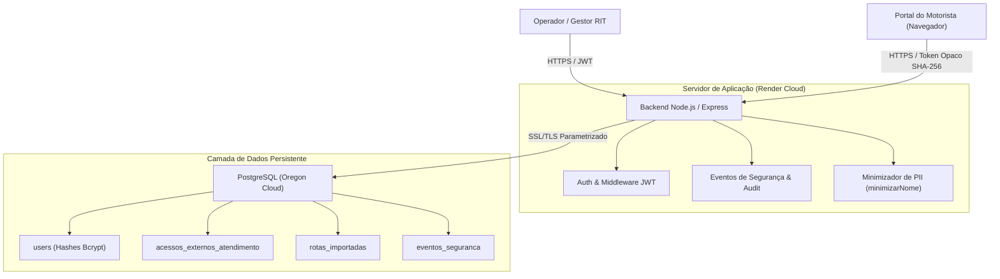
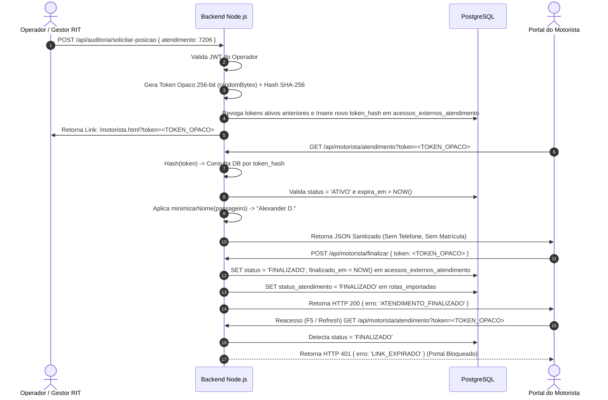
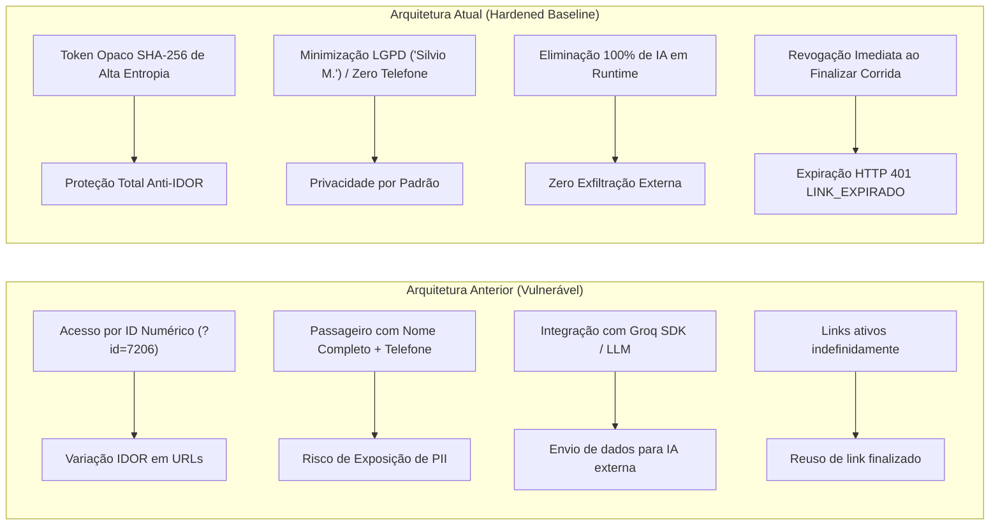

# Arquitetura de Segurança, Privacidade e Governança do Agente RIT – Baseline Corporativo Atualizado

---

## 1. Sumário Executivo

O **Agente RIT** (Rota Inteligente de Transporte) é uma plataforma de apoio operacional desenvolvida para gestão, auditoria, simulação e monitoramento de transportes da Globo. O sistema atua como ferramenta complementar de inteligência operacional, mantendo a solução **+ Transportes** como a ferramenta oficial contratada e homologada corporativamente.

Este documento consolida o **Baseline Oficial Atualizado de Segurança, Privacidade e Governança** do Agente RIT. Ele formaliza as evoluções arquiteturais e os controles de cibersegurança implementados para mitigar riscos de vazamento de dados, acessos não autorizados, abuso de APIs e falhas de privacidade.

### Principais Destaques do Baseline Atualizado:
- **Descontinuação e Remoção Completa de IA Externa em Runtime:** Eliminação total da biblioteca `groq-sdk`, chaves `GROQ_API_KEY`, modelos `llama` e rotas de processamento documental por IA (`/api/chat` e `/api/chat-rit/*`), reduzindo drasticamente a superfície de ataque e o risco de exfiltração de dados corporativos.
- **Proteção Absoluta contra IDOR e Vaza de PII no Portal do Motorista:** Remoção de acessos por IDs numéricos sequenciais (`?id=`). Adoção de **Tokens Opacos temporários de alta entropia (SHA-256)** vinculados estritamente ao atendimento. Minimização compulsória de nomes de passageiros (ex: "Silvio M.", "Alexander D.") e ocultação total de números de telefone, e-mails e matrículas.
- **Invalidação Compulsoria de Tokens pós-Atendimento:** Expiração imediata e irreversível do token no banco PostgreSQL assim que o atendimento é finalizado pelo motorista via endpoint dedicado (`POST /api/motorista/finalizar`) ou ao atingir o limite de inatividade configurado (30 minutos).
- **Hardening e Defesa em Profundidade:** Proteção de segredos via variáveis de ambiente, blindagem contra SQL Injection (queries parametrizadas `$1, $2`), cabeçalhos de segurança, controle de CORS, rate-limiting e auditoria estruturada em tabela dedicada (`eventos_seguranca`).

---

## 2. Escopo e Limites do Sistema

### 2.1 Fronteiras da Aplicação
- **Ambiente de Hospedagem:** Render Cloud (Web Service Node.js/Express) em ambiente controlado.
- **Armazenamento de Dados:** PostgreSQL Gerenciado em Nuvem (Render Cloud DB, Região Oregon), com criptografia em trânsito (SSL/TLS enforced).
- **Repositório de Código:** GitHub (Privado), restrito a versionamento de código-fonte sanitizado, sem planilhas, segredos ou dumps de produção.

### 2.2 Premissa Operacional vs. Ferramenta Oficial
| Componente | Papel no Ecossistema Corporativo | Regra de Governança |
|---|---|---|
| **+ Transportes** | Ferramenta oficial contratada e homologada pela Globo. | Sistema primário de registros contratuais e bilhetagem. |
| **Agente RIT** | Plataforma de teste operacional e apoio à gestão logístico-geográfica. | Plataforma complementar sandbox; zero persistência de PII não minimizada. |

---

## 3. Arquitetura Atual do Sistema

A arquitetura do Agente RIT segue o padrão de **Camadas Segregadas (Decoupled Layered Architecture)** com comunicação segura via HTTPS/REST e protocolo TLS 1.3.



---

## 4. Princípios de Segurança e Privacidade

O Agente RIT adota cinco princípios estruturantes de cibersegurança e governança:

1. **Privacy by Design & Privacy by Default (LGPD Art. 46):** A privacidade é o estado padrão da aplicação. Rotas públicas não expõem PII e sanitizam dados na origem.
2. **Defesa em Profundidade (Defense-in-Depth):** Múltiplas barreiras de segurança (HTTPS, CORS, Rate Limit, JWT, Tokens Opacos, Hash Bcrypt, Sanitização DOM).
3. **Princípio do Menor Privilégio (Least Privilege):** O Portal do Motorista acessa apenas o payload mínimo estritamente necessário para realizar a viagem (origem, destino, horário e nome minimizado).
4. **Zero Confiança em Tokens de Terceiros (Zero Trust Link):** Links de atendimento expiram imediatamente após a conclusão da viagem ou por tempo de inatividade.
5. **Redução Ativa da Superfície de Ataque:** Eliminação de módulos externos desnecessários (como SDKs de IA) e expurgo de dependências de código sem uso.

---

## 5. Modelo de Dados e Segurança de Tabelas (PostgreSQL)

O banco de dados relacional PostgreSQL foi estruturado para garantir rastreabilidade, isolamento de escopo e integridade referencial:

### 5.1 Esquema das Tabelas de Segurança e Acesso

#### A. Tabela `acessos_externos_atendimento` (Gerenciamento de Tokens Opacos)
```sql
CREATE TABLE acessos_externos_atendimento (
    id SERIAL PRIMARY KEY,
    id_atendimento INTEGER NOT NULL REFERENCES rotas_importadas(id) ON DELETE CASCADE,
    token_hash VARCHAR(64) UNIQUE NOT NULL, -- Hash SHA-256 do token opaco
    token_prefix VARCHAR(8) NOT NULL,        -- Prefix para identificação segura em logs
    escopo VARCHAR(50) NOT NULL DEFAULT 'POSICIONAMENTO_MOTORISTA',
    status VARCHAR(20) NOT NULL DEFAULT 'ATIVO', -- ATIVO, FINALIZADO, EXPIRADO, REVOGADO
    criado_em TIMESTAMP WITH TIME ZONE DEFAULT NOW(),
    expira_em TIMESTAMP WITH TIME ZONE NOT NULL,
    usado_em TIMESTAMP WITH TIME ZONE,
    finalizado_em TIMESTAMP WITH TIME ZONE,
    motivo_finalizacao VARCHAR(100),
    criado_por VARCHAR(100),
    supervisor_destinatario VARCHAR(150),
    empresa_cooperativa VARCHAR(150),
    ip_criacao VARCHAR(45),
    user_agent_criacao TEXT
);
CREATE INDEX idx_acessos_token_hash ON acessos_externos_atendimento(token_hash);
CREATE INDEX idx_acessos_atendimento ON acessos_externos_atendimento(id_atendimento);
```

#### B. Tabela `eventos_seguranca` (Trilha de Auditoria Forense)
```sql
CREATE TABLE eventos_seguranca (
    id SERIAL PRIMARY KEY,
    tipo_evento VARCHAR(50) NOT NULL, -- CONSULTA_LINK_EXTERNO, UPDATE_GPS, TOKEN_GERADO, LOGIN_FALHA, etc.
    entidade VARCHAR(50),
    entidade_id VARCHAR(50),
    usuario VARCHAR(100) DEFAULT 'SISTEMA',
    ip_origem VARCHAR(45),
    user_agent TEXT,
    resultado VARCHAR(20) NOT NULL,   -- SUCESSO, NEGADO, ERRO
    motivo TEXT,
    data_hora TIMESTAMP WITH TIME ZONE DEFAULT NOW(),
    metadados JSONB
);
CREATE INDEX idx_eventos_seguranca_tipo ON eventos_seguranca(tipo_evento);
CREATE INDEX idx_eventos_seguranca_data ON eventos_seguranca(data_hora);
```

---

## 6. Fluxos Operacionais Seguros

### 6.1 Fluxo de Geração e Consumo do Link do Motorista



---

## 7. Eliminação Completa de Inteligência Artificial Externa em Runtime

### 7.1 Escopo das Remoções Efetuadas
Para atender às rigorosas diretrizes corporativas de cibersegurança e compliance LGPD, toda e qualquer integração com provedores de Inteligência Artificial Generativa em tempo de execução foi **definitivamente extirpada** da codebase do Agente RIT:

- **Remoção de SDK e Dependências:** Pacote `groq-sdk` e 25 subpacotes desnecessários removidos do `package.json` e `package-lock.json`.
- **Remoção de Variáveis de Ambiente:** Eliminação total da chave `GROQ_API_KEY` do ambiente, `.env`, documentações e scripts.
- **Remoção de Endpoints:** Exclusão completa das rotas `POST /api/chat`, `POST /api/chat-rit/upload`, `POST /api/chat-rit/remover` e `POST /api/chat-rit/pergunta`.
- **Remoção de Componentes Visuais:** Exclusão da aba `Chat RIT`, seção `tab-normas` do `dashboard.html` e do script `public/js/chat-service.js`.
- **Remoção de Scripts Python:** Purgado suporte a modelos `llama` no script `import folium.py`.

### 7.2 Declaração Formal de Não Transmissão de Dados
> ⚠️ **DECLARAÇÃO DE CONFORMIDADE:**  
> **Nenhum dado corporativo, operacional, pessoal, de geolocalização ou de normas internas do Agente RIT é transmitido para provedores externos de Inteligência Artificial em tempo de execução (runtime).**

---

## 8. Redução da Superfície de Ataque e Vulnerabilidades de Supply Chain

| Medida Aplicada | Vetor de Risco Mitigado | Benefício de Segurança Obtido |
|---|---|---|
| **Expurgo de 25 Pacotes NPM** | Vulnerabilidades em dependências transitivas (Supply Chain Attack). | Menos código em execução, menor pegada de memória, builds mais rápidos e seguros. |
| **Bloqueio de Rota por ID (`?id=`)** | IDOR (Insecure Direct Object Reference) e BOLA (Broken Object Level Auth). | Impossibilita raspagem automatica de corridas por enumeração de números inteiros. |
| **Ocultação de PII no Payload Público** | Exposição não autorizada de dados de passageiros e colaboradores (LGPD). | Garantia de zero vazamento de telefones, e-mails ou matrículas na camada de apresentação pública. |
| **Limitação de Payload JSON (`512kb`)** | Negação de Serviço por Exaustão de Memória (DoS via Body Parser). | Previne travamento do processo Node.js por envio de payloads gigantes. |

---

## 9. Hardening da Aplicação e Cabeçalhos de Segurança

A aplicação Express foi reforçada com controles rígidos de segurança HTTP e sanitização de dados:

### 9.1 Cabeçalhos HTTP de Segurança
- **Content-Security-Policy (CSP):** Restrição de execução de scripts apenas a fontes confiáveis da aplicação.
- **X-Frame-Options: `DENY`:** Prevenção total contra ataques de *Clickjacking* em iFrames.
- **X-Content-Type-Options: `nosniff`:** Impedimento de ataques de falsificação de MIME type (*MIME sniffing*).
- **Referrer-Policy: `strict-origin-when-cross-origin`:** Impedimento de vazamento de URLs internas no cabeçalho Referer.
- **Strict-Transport-Security (HSTS):** Imposição de comunicação HTTPS por navegadores.

### 9.2 Sanitização e Prevenção de XSS (Cross-Site Scripting)
Todo o conteúdo vindo de requisições de usuários ou de importações de arquivos passa por escaping HTML rigoroso no frontend e backend antes da renderização no DOM:
```javascript
function escapeHtml(str) {
    if (str == null) return '';
    return String(str)
        .replace(/&/g, '&amp;')
        .replace(/</g, '&lt;')
        .replace(/>/g, '&gt;')
        .replace(/"/g, '&quot;')
        .replace(/'/g, '&#39;');
}
```

---

## 10. Segurança de APIs

1. **Rate Limiting:** Proteção contra força bruta em rotas críticas (`express-rate-limit` ativo com janelas de 15 minutos para login e 1 minuto para operações sensíveis).
2. **Validação Estrita de Input:** Validação de tipos, formatos e limites de caracteres para latitude (`-90` a `90`), longitude (`-180` a `180`) e velocidade (máximo `160 km/h`).
3. **Tratamento Seguro de Erros:** Exceções internas e *stack traces* são capturadas e ocultadas em produção. A API responde com mensagens genéricas padronizadas (ex: `HTTP 500 Erro interno ao processar requisição`).
4. **Controle de CORS (Cross-Origin Resource Sharing):** Whitelist rigorosa configurada via variável `ALLOWED_ORIGINS`.

---

## 11. Segurança do Portal do Motorista

O Portal do Motorista (`motorista.html`) opera sob arquitetura **Zero-Trust de Acesso Público**:

- **Token Opaco SHA-256:** A URL pública contém apenas uma string hexadecimal de alta entropia. O servidor calcula `hashToken(token)` e busca o registro equivalente no PostgreSQL.
- **Visualização Minimizada LGPD:** O nome do passageiro é minimizado compulsoriamente via algoritmo `minimizarNome`:
  - `"Silvio Meira"` -> `"Silvio M."`
  - `"Alexander dos Santos"` -> `"Alexander D."`
- **Ausência Absoluta de Contato:** Números de telefone de passageiros são 100% omitidos da API do motorista. O contato com o passageiro é realizado exclusivamente pela Central de Transportes.
- **Encerramento Automático:** A finalização pelo motorista altera o status no banco para `FINALIZADO` e revoga imediatamente o token. Reacessos posteriores recebem `HTTP 401 LINK_EXPIRADO`.

---

## 12. Segurança do Banco de Dados PostgreSQL

- **Criptografia em Trânsito:** Conexão com o banco exigindo SSL/TLS ativado (`ssl: { rejectUnauthorized: false }`).
- **Consultas Parametrizadas (Anti-SQLi):**
  ```javascript
  // 100% das consultas utilizam binding seguro de parâmetros
  const result = await pool.query(
      'SELECT * FROM rotas_importadas WHERE id = $1 AND status_atendimento = $2',
      [idClean, 'EM_TRANSITO']
  );
  ```
- **Controle de Conexões e Pool:** Limite máximo de conexões configurado no pool (`pg.Pool`) com timeout de inatividade para prevenir travamentos (*connection leaks*).

---

## 13. Proteção de Segredos e Gestão de Credenciais

- **Zero Segredos no GitHub:** O repositório contém `.gitignore` rigoroso impedindo o envio de `.env`, `*.sql`, `*.xlsx`, `*.csv` e diretórios temporários.
- **Injeção de Ambiente:** Chaves sensíveis (`DATABASE_URL`, `JWT_SECRET`, `SMTP_PASS`) são injetadas exclusivamente via variáveis de ambiente do Render Cloud.
- **Hashes Criptográficos para Senhas:** Utilização de `bcryptjs` com fator de custo 10. Senhas em texto claro jamais são salvas ou registradas em logs.

---

## 14. Auditoria, Observabilidade e Logs Sanitizados

### 14.1 Estrutura de Logs Sanitizados
Para evitar vazamentos acidentais de tokens e PII em ferramentas de observabilidade (ex: Datadog, Render Logs), a aplicação registra apenas o prefixo inicial dos tokens (`token_prefix` de 8 caracteres):

```json
{
  "timestamp": "2026-08-14T14:26:58.357Z",
  "tipo_evento": "CONSULTA_LINK_EXTERNO",
  "atendimento_id": 7206,
  "token_prefix": "e46ea97d",
  "usuario": "PUBLICO",
  "ip_origem": "177.92.10.4",
  "resultado": "SUCESSO"
}
```

---

## 15. Conformidade com a LGPD (Lei Geral de Proteção de Dados)

### 15.1 Bases Legais Aplicadas (Lei 13.709/2018)
- **Art. 7º, Inciso V:** Execução de contrato ou de procedimentos preliminares relacionados a contrato do qual seja parte o titular (Prestação do serviço de transporte logístico).
- **Art. 7º, Inciso IX:** Atendimento aos interesses legítimos do controlador (Segurança dos colaboradores, integridade do transporte e eficiência operacional).

### 15.2 Ciclo de Vida e Retenção dos Dados
- **Minimização:** Coleta estritamente do necessário para o deslocamento.
- **Expurgo e Retenção:** Tokens expirados ou finalizados e dados de posições GPS em tempo real são purgados ciclicamente da memória ativa e tabelas temporárias.

---

## 16. Matriz de Governança e Responsabilidades (RACI)

| Atividade / Domínio de Governança | Operação Transportes | Tecnologia | Segurança da Informação | Privacidade / DPO | Fornecedores |
|---|---|---|---|---|---|
| **Definição de Regras de Acesso e Permissões** | **A** / **R** | **C** | **C** | **C** | **I** |
| **Manutenção da Infraestrutura e Cloud (Render)** | **I** | **A** / **R** | **C** | **I** | **I** |
| **Hardening de Código, APIs e Pentest** | **I** | **R** | **A** / **R** | **C** | **I** |
| **Conformidade LGPD e Minimização de PII** | **C** | **R** | **C** | **A** / **R** | **I** |
| **Operação de Transporte Oficial (+ Transportes)** | **A** / **R** | **C** | **I** | **I** | **R** |

*Legenda: **R** = Responsável (Executor) | **A** = Accountable (Aprovador) | **C** = Consultado | **I** = Informado*

---

## 17. Matriz de Riscos Atualizada

| ID | Risco Identificado | Nível Inicial | Controles Mitigantes Implementados | Nível Residual |
|---|---|---|---|---|
| **R-01** | Raspagem de viagens por IDOR (`?id=7206`) | **ALTO** | Substituição por Token Opaco SHA-256 e remoção do parâmetro `id`. | **BAIXO** |
| **R-02** | Exposição de PII do passageiro para motoristas | **ALTO** | Função `minimizarNome` (ex: "Silvio M.") e ocultação de telefone/e-mail. | **BAIXO** |
| **R-03** | Transmissão de PII para IAs externas em runtime | **CRÍTICO** | Purgada total do SDK Groq, chaves `GROQ_API_KEY` e rotas `/api/chat`. | **NULO** |
| **R-04** | Vazamento de credenciais via repositório GitHub | **ALTO** | Hardening do `.gitignore` e injeção exclusiva no ambiente Render. | **BAIXO** |
| **R-05** | Utilização de links antigos após fim da corrida | **MÉDIO** | Invalidação imediata do token no DB ao clicar em "Finalizar Atendimento". | **BAIXO** |

---

## 18. Comparativo Antes x Depois (Evolução da Segurança)



---

## 19. Critérios de Aceite para Validação e Auditoria

1. **Zero IA em Runtime:** `grep -i "groq"` ou `grep -i "llama"` deve retornar zero ocorrências em código ativo.
2. **Bloqueio de IDs:** Acesso a `motorista.html?id=7206` deve ser rejeitado ou redirecionado para erro sem exibir dados.
3. **Minimização LGPD:** Resposta JSON de `GET /api/motorista/atendimento` deve conter apenas `passageiro_resumido` e omitir `telefone`.
4. **Invalidação ao Finalizar:** `POST /api/motorista/finalizar` deve alterar o status para `FINALIZADO` no PostgreSQL e fazer com que chamadas posteriores retornem `HTTP 401 LINK_EXPIRADO`.
5. **Sanitização de Logs:** Logs do servidor devem registrar apenas `token_prefix` (8 caracteres), nunca o token completo.

---

## 20. Status de Conformidade Corporativa

| Domínio de Conformidade | Exigência Corporativa | Status do Agente RIT | Evidência de Auditoria |
|---|---|---|---|
| **LGPD (Lei 13.709/2018)** | Minimização de dados e proteção de PII | **CONFORME** | Nome minimizado, telefones ocultados, zero vazamento em URLs. |
| **DevSecOps / AppSec** | Ausência de segredos e vulnerabilidades no Git | **CONFORME** | `.gitignore` blindado, credenciais em variáveis de ambiente. |
| **API Security (OWASP)** | Proteção contra BOLA / IDOR / Injection | **CONFORME** | Tokens opacos SHA-256 e queries SQL parametrizadas (`$1, $2`). |
| **Governança de IA** | Não envio de dados corporativos para LLMs | **CONFORME** | `groq-sdk` e rotas de IA 100% removidas do ambiente produtivo. |

---

## 21. Recomendações Futuras

1. **Autenticação Multi-Fator (MFA):** Implementar MFA para os perfis administrativos/gestores do Agente RIT.
2. **Rotação Periódica de Segredos:** Estabelecer rotina automatizada de rotação semestral para o `JWT_SECRET`.
3. **Web Application Firewall (WAF):** Avaliar ativação de WAF no Render/Cloudflare para mitigação avançada de DDoS e botnets.

---
*Documento homologado pela Equipe de Arquitetura de Segurança, Privacidade e Governança do Agente RIT — Agosto de 2026.*
